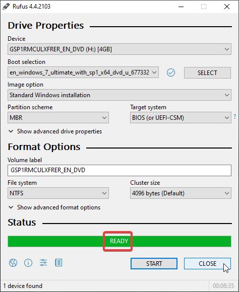
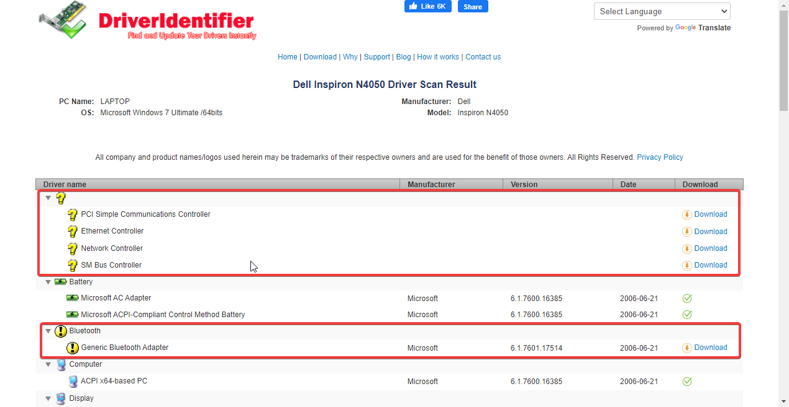

## Introduction

This is my journey of installing Windows 7 for minimal office use in Sri Lanka. The device that i'm dealing with today is an ancient Dell Inspiron N4050 from 2014 (a 10 year Intel i3 laptop).

This has a completely functional copy of Linux Mint installed, thats customized to look like Windows 7.

This laptop is equipped with an i3-2350M,  10 Gigabytes of RAM with a SATA SSD. 

The user requirements of this laptop has changed and legacy sinhala font support (FM Bindumathi, FM Gemunu, FM Abhaya, etc...) with the microsoft office suite was a must, so the only option left is to either install Windows 10 or 8 and get the system bloated and slow or to install Windows 7 in 2024. 

Yes, Windows 8 is also discontinued now, but, I personally don't think that it would support this device very well.

I'm not a huge fan of Windows 8 anyways, so, Windows 7 it is.

## Installation

You can download the Windows 7 SP1 Ultimate image [from here](https://archive.org/details/7601.24214.180801-1700.win-7sp-1-ldr-escrow-client-ultimate-x-64-fre-en-us_202304) 

After downloading it, we can write that installation media to a pendrive and boot from it using tools like [Rufus: The Reliable USB Formatting Utility](https://rufus.ie/en/) - a Free and Open Source Tool. 

Open Rufus, plug-in your pendrive, select the downloading image (the `.iso` file). 

Make sure to select the **Partition Scheme** as **MBR** and the **Target System** as **BIOS** when you are trying flash a pendrive for older computers.

What if you don't?

You will get this error after you boot from the pendrive after selecting it from the Boot Menu:

Click on the start button to flash the image make your pendrive bootable.

After you see "READY" in the progress bar, you are good to go. 

Remove the pendrive and plug it in to the system that we are going to install the new operating system to.

- and now, our pendrive is ready
  

- installationthe
- thorium
- drivers
- tell the issue with internet and bluetooth drivers

- open the file in a computer with an internet connection
  

- this page will be loaded
  

- we can download the drivers that we want

- or the other option would be to use the dell's official website
