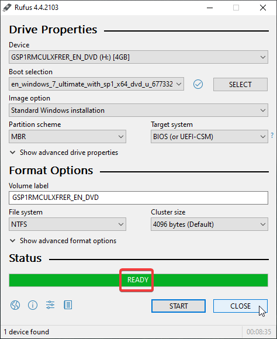

# installing windows 7 in 2024 for sri lankan office work

- this is my journey about installating windows 7 in 2024 to an ancient dell inspiron 4050N
- this device already has a function copy of linux mint customized to look like windows xp
- but the requirements has changed and microsoft office is a must, with legacy sinhala font support (yes, not unicode, fonts like FM Bindumathi, etc...)

- first lets make a bootable usb with rufus.
- make sure to select the partition scheme to MBR and target system to BIOS
- to make sure that it supports older hardware
- or you will run into this error:
  

- click on start to make the pendrive bootable
  

- and now, our pendrive is ready
  

- installation
- thorium
- drivers
- tell the issue with internet and bluetooth drivers

- open the file in a computer with an internet connection
  

- this page will be loaded
  

- we can download the drivers that we want

- or the other option would be to use the dell's official website
