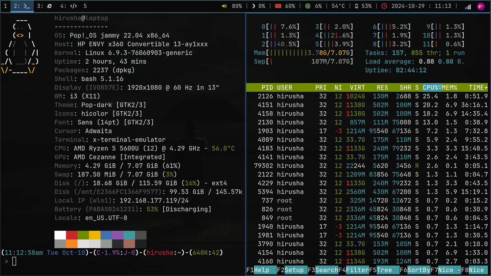
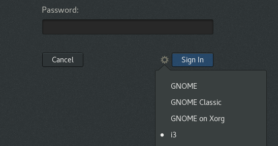
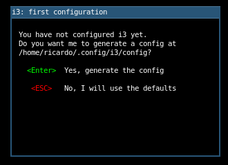
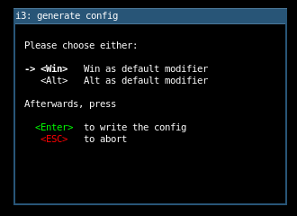
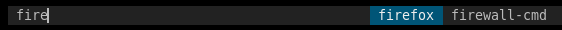
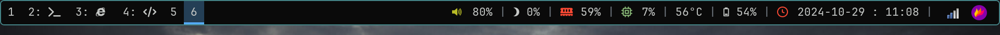
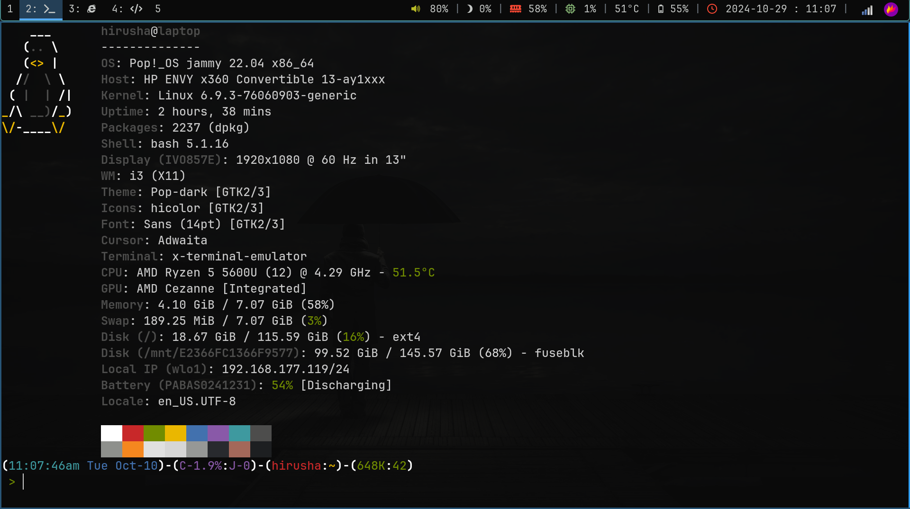

This guide is for user's running Ubuntu 22.04 on their laptops. Everything mentioned in this post has been tested on Pop OS 22.04 (non NVIDIA edition).

Note: Do not proceed if you are not the type of person that is ready to read documentation.

## Why i3wm?

i3wm is highly documented, and has more support online. It's not based on Wayland. So, i dont have trouble with NVIDIA GPUs.

Learn the basics and use it for 30 minute's and you wouldn't want to swicth back. You dont have to keep on pressing Alt+Tab severl times to go through and select open windows. you can launch apps quickly. You can see your system's information easily at a glance. Its lightweight. Its extremely customizable. Its efficient, so, it saves time. ots quick and easy to navigate (after getting used to, which you can - even within several minutes)

## i3wm

### Installation

On PopOS, you can run the command below to install i3wm and all of its default dependencies. 

```bash
sudo apt install i3
```

### Initial Setup

After the installation has succeeded, you need to logout (using the GUI or by running the `logout` command) of your system, and log back in, selecting "i3(wm)" as your session by entering your password.



Once back you log in, everything will be black and gone. You are represented with the i3 configuration screen.



Press `ENTER` to create/dump the default configuration file in into `~/.config/i3/config`. We will be coming back to this file for further customizations.

On the next screen, you need to select your modifier key. This is important, as the "Mod" key is used to trigger most of i3's keyboard shortcuts. 



Use your (up and down) arrow keys to navigate and choose the modifier key you like. I personally prefer `<Alt>`, since you will be pressing this key like 90% of the time.

Press `ENTER` to confirm. 


Note: Since i selected the `Alt` key as my `Mod` key, in this blog post, form here onwards, wheren i say `Alt+X`, what is actually means is `Mod+X` where `Mod` is your modifier key.

All you have now is an empty black screen.

### Looking Around

To open an application, you can `Alt+D` to open i3 `dmenu` to open your applications from. You can type the package name to start it. eg: `firefox` to open yourbrwoser. Note that the application that you are to open with dmenu must be in your path already.



Now, open your browser and go to [introduction section](https://i3wm.org/docs/userguide.html#_using_i3) of the official documentation.

And then, optionally, you may also watch this great [youtube video](https://youtu.be/j1I63wGcvU4?si=KS20xtV5_UcEtttC).

Try the key bindings out yourself and practice the basics for like 10-15 minutes.

From this point onwards, i will assume that you are familiar with the key bindings.

### Lightdm

Note: This section is optional.

To further save resources, you can switch from gdm to lightdm. 

Install lightdm:

```
sudo apt install lightdm
```

If you were not prompted to configure it as the default display manager, you can run the command below to manually configure it.

```
sudo dpkg-reconfigure lightdm
```

For the changes to take place, you can restart your computer.

```
sudo reboot
```

## Fonts

### Installation

Download ["JetBrainsMono Nerd Font"](https://www.nerdfonts.com/font-downloads) from this website.

Install the fonts:

```
mkdir tmp-fonts && cd tmp-fonts
mv ../JetBrainsMono.zip .
unzip ./JetBrainsMono.zip
mv ./* ~/.fonts/
cd ..
rm -rf tmp-fonts
```

You can also remove and re-build the font cache:

```
rm -rf ~/.cache/fontconfig
sudo fc-cache -r -v
```

### Update Fonts (i3)

in the i3 config:

```
font pango:JetBrainsMono Nerd Font 14
```

## Custom Wallapers

Install `feh`, a command line utility that we can use the change the wallpaper:

```bash
sudo apt install feh
``` 

The command below will change the wallpaper to the picture available at `/mnt/E2366FC1366F9577/Pictures/wallpaper.jpg`

```
feh --bg-fill /mnt/E2366FC1366F9577/Pictures/wallpaper.jpg
```

In the i3 config file, With `exec` you can configure which commands will be performed by i3 on initial startup. `exec` commands will not run when restarting i3, if you need a command to run also when restarting i3 you should use the `exec_always` keyword. These commands will be run in order. [Click here](https://i3wm.org/docs/userguide.html#_automatically_starting_applications_on_i3_startups) to learn more.


- `~/.config/i3/config`

```
exec_always feh --bg-fill /mnt/E2366FC1366F9577/Pictures/wallpaper.jpg
```

This will run this command on startup and also on when restrating the i3 session - which will set the background wallpaper.

## Color Scheme

This part is optional. You can update the color scheme, of the border and everything else in i3 by updating the config file.

```
# class                 border  backgr. text    indicator child_border
client.focused          #4c7899 #285577 #ffffff #2e9ef4   #285577
client.focused_inactive #333333 #5f676a #ffffff #484e50   #5f676a
client.unfocused        #333333 #222222 #888888 #292d2e   #222222
client.urgent           #2f343a #900000 #ffffff #900000   #900000
client.placeholder      #000000 #0c0c0c #ffffff #000000   #0c0c0c

client.background       #ffffff
```

Update the colors using whatever the color palette you like. I'm bad at matching colors. So, im sticking to a slightly modified version of the blue color theme provided in the config file [here](https://i3wm.org/docs/userguide.html#client_colors).

## Title Bar

This part is optional. The title bar is useless for me, so, i'm getting rid of it. To do it, add this to your config file. replacing `2` with `0` will show no border at all, but i want atleast a very light border to distinguish between windows open in each workplace whenever theres more than one.

```
for_window [class="^.*"] border pixel 2
```

Breaking this down, it means to set the border to 2 pixels, for all windows (selected by `for_window [class="^.*"]`)


## Laptop User Experience

### Volume Controls

Assuming you already use pulseaudio, you should also have pactl installed. So, you can simply add these to the config file. In new versions on i3wm, these already exist in the i3 config file. 

```bash
# Use pactl to adjust volume in PulseAudio.
set $refresh_i3status killall -SIGUSR1 i3status
bindsym XF86AudioRaiseVolume exec --no-startup-id pactl set-sink-volume @DEFAULT_SINK@ +10% && $refresh_i3status
bindsym XF86AudioLowerVolume exec --no-startup-id pactl set-sink-volume @DEFAULT_SINK@ -10% && $refresh_i3status
bindsym XF86AudioMute exec --no-startup-id pactl set-sink-mute @DEFAULT_SINK@ toggle && $refresh_i3status
bindsym XF86AudioMicMute exec --no-startup-id pactl set-source-mute @DEFAULT_SOURCE@ toggle && $refresh_i3status
```

### Audio Controls

`playerctl` command line utility is also pre-installed and pre-configured in PopOS 22.04. So, you can add these lines to your i3 config file. If it's not installed, you will have to install it and start the daemon manually. [Click here](https://github.com/altdesktop/playerctl) to learn more.

```
bindsym XF86AudioPlay exec playerctl play
bindsym XF86AudioPause exec playerctl pause
bindsym XF86AudioNext exec playerctl next
bindsym XF86AudioPrev exec playerctl previous
```

### Brightness Controls

First, install `brightnessctl`. This is a command line utility which we can use to adjust the brightness of the screen.

```
sudo apt install brightnessctl
```

To increase the brightness by 5%, you can run:

```
sudo brightnessctl set +5%
```

To decrease the brightness by 5%, you can run:

```
sudo brightnessctl set 5%-
```

When i tried it without sudo, which i think is how i3 will run it (not as root), it won't work.

If it works without sudo, simply add the lines below to your i3 config and skip to the next section. 

```
bindsym XF86MonBrightnessUp exec --no-startup-id brightnessctl set +5%
bindsym XF86MonBrightnessDown exec --no-startup-id brightnessctl set 5%-
```


As it doesn't work without sudo, and since sudo will ask prompt you for the password, let's edit the sudoers file. An issue regarding this can be found [here](https://github.com/i3/i3/discussions/4763).

Run the command below to start editing

```
sudo vistudio
```

Adding this line to end of the sudoers file at `/etc/sudoers`, will stop prompting for the password when the user named `hirusha` is executing `/usr/bin/brightnessctl`. Make sure to replace your actual username with `hirusha`   

```
hirusha ALL=(ALL) NOPASSWD: /usr/bin/brightnessctl
```

Note: I am no expert and this was a workaround for it. Some of the functionality might break if there are multiple user accounts, who will use i3 with the same configuration. - which is less likely to happen. 

Now, you can edit the ifconfig i3 config file.

```
bindsym XF86MonBrightnessUp exec --no-startup-id sudo brightnessctl set +5%
bindsym XF86MonBrightnessDown exec --no-startup-id sudo brightnessctl set 5%-
```

### Touchpad Controls

Tapping with two fingers to right click is something that i cannot live without on my HP Envy x360. This is done with [libinput-gestures](https://github.com/bulletmark/libinput-gestures)

You need python 3.7 or later, python2 is not supported. You also need libinput release 1.0 or later.

You must be a member of the input group to have permission to read the touchpad device:

```
sudo gpasswd -a $USER inputd
```

After executing the above command, reboot your system.

Then, install `wmctrl` which is necessary for `_internal` command, as per default configuration, `xdotool` for simulating keyboard and mouse actions for Xorg or XWayland based apps.

```
sudo apt-get install wmctrl xdotool
```

First, install `libinput-tools`

```
sudo apt-get install libinput-tools
```

Then, to install `libinput-gestures` - you will have to install it manually.

Clone the repository:

```bash
# clone the repository
git clone https://github.com/bulletmark/libinput-gestures.git

# go into the cloned folder
cd ./libinput-gestures

# run the installation script.
sudo ./libinput-gestures-setup install
```

Then, add this to your i3 config file to start `libinput-gestures` automatically.

```
exec --no-startup-id "sudo libinput-gestures-setup start"
```

## The Bar



### Remove Default Bar

```
bar {
  ...
}
```

Find the `bar` section in the i3 config file and delete / comment it. Restart i3 using `Alt+Shift+R` and the status bar will be gone.

Note that you can still launch the terminal using `Alt+Return`.

### Install [Polybar](https://github.com/polybar/polybar)

The version available the ubuntu/debian package repositories are too outdated, and there are no proper customization guides for old versions. So, we will also have to build Polybar from source. [Clich here](https://github.com/polybar/polybar/wiki/Compiling#building) to view the official documentation.

To get the sources directly from the repository, run the following commands:

Warning: Compiling polybar this way will give you the latest unreleased changes, there may be bugs and it may break your config.

```bash
# make sure to type the `git' command as-is to clone all git submodules too
git clone --recursive https://github.com/polybar/polybar

# go into the cloned folder
cd polybar
```

To compile, run the following commands:

Note: If you are using anaconda, run conda deactivate before running cmake, also see the note on the [Known Issues page](https://github.com/polybar/polybar/wiki/Known-Issues#building-with-anaconda-installed) if that doesn't work.

Note: Similarly, if you are using pyenv, you will likely need to use system python during compilation. You can revert to system python in the current directory by executing pyenv local system directly before executing cmake.

```bash
mkdir build
cd build
cmake ..
make -j$(nproc)

# to install polybar into /usr/bin
sudo make install
```

### Initial Configuration

You can now copy the default configuration file (`config.ini`) and start editing it to match your needs.

```
cp /etc/polybar/config.ini ~/.config/polybar/config.ini
```

Open the copied configuration file and edit the name of the bar to `bar`, so, it should look like this now:

```
...

[bar/bar]

...
```

You can now launch polybar by running the `polybar` command in your terminal. 

But, we will start the bar in your i3wm's bootstrap routine.

First, lets create the startup script at: `~/.config/i3/launch-polybar.sh`

```bash
#!/usr/bin/env bash

# Terminate already running bar instances
# If all your bars have ipc enabled, you can use 
polybar-msg cmd quit
# Otherwise you can use the nuclear option:
# killall -q polybar

# Launch the bar named: bar
echo "---" | tee -a /tmp/polybar1.log
polybar bar 2>&1 | tee -a /tmp/polybar1.log & disown

echo "Bars launched..."
```

Note that in the script above, `bar` is the name of the bar, as we set it above.

Then, we can start this script with i3 config file

```
exec_always ~/.config/i3/launch.sh
```

### How it works?

Polybar has several modules. [Click here](https://github.com/polybar/polybar/wiki/Module:-script) to learn what a module is. Basically, its a block of text/icon shown on the bar. You can use many of the pre-written modules or you can easily create your own.

### Modules Introduction

Here are some basics. You can learn everything required [here](https://github.com/polybar/polybar/wiki). Also, all the options for each module are given in the documentation.

```ini
[module/module_name]                ; `module_name` is the name of the module       
type = ...                          ; type of the module. refer to docs for more info
interval = 5                        ; how often to update this? `5` means update each 5 seconds
format-prefix = "  "               ; icon (LHS) of the module text/content
format-prefix-foreground = #ff0000  ; color of the icon
format-margin = 8pt                 ; margin of the icon
```

### Modules

The modules that i have are:

- to show the workspaces used:

```ini
[module/xworkspaces]
type = internal/xworkspaces
label-active = %name%
label-active-background = ${colors.background-alt}
label-active-underline= ${colors.primary}
label-active-padding = 1
label-occupied = %name%
label-occupied-padding = 1
label-urgent = %name%
label-urgent-background = ${colors.alert}
label-urgent-padding = 1
label-empty = %name%
label-empty-foreground = ${colors.disabled}
label-empty-padding = 1
```

- to show the audio volume level. You can also control this by scrolling on top of it.

```ini
[module/pulseaudio]
type = internal/pulseaudio
format-volume-prefix = "  "
format-volume-prefix-foreground = ${colors.green}
format-volume = <label-volume>
label-volume = %percentage%%
label-muted = muted
label-muted-foreground = ${colors.disabled}
```

- to show the date and time

```ini
[module/datetime]
type = internal/date
interval = 5
date = "%Y-%m-%d%"
time = "%H:%M"
label = "%date% : %time%"
format-prefix = "  "
format-prefix-foreground = ${colors.red}
```

- show the memmory usage

```ini
[module/memory]
type = internal/memory
interval = 2
format-prefix = "  "
format-prefix-foreground = ${colors.red}
label = %percentage_used:2%%
```

- show cpu usage

```ini
[module/cpu]
type = internal/cpu
interval = 2
format-prefix = " "
format-prefix-foreground = ${colors.aqua}
label = %percentage:2%%
```

- for the system tray (very useful)

```ini
; This module is not active by default (to enable it, add it to one of the
; modules-* list above).
; Please note that only a single tray can exist at any time. If you launch
; multiple bars with this module, only a single one will show it, the others
; will produce a warning. Which bar gets the module is timing dependent and can
; be quite random.
; For more information, see the documentation page for this module:
; https://polybar.readthedocs.io/en/stable/user/modules/tray.html
[module/systray]
type = internal/tray
format-margin = 8pt
tray-spacing = 16pt
```


### Modules (Advanced)

#### CPU Temperature

Note that you must edit the `thermal-zone`, `zone-type`, `hwmon-path` for this to work on your system. The comments should guide you. Basically, do what the comment says, its to run a command. Run them, and select the cpu by going through the output.


```ini
[module/cpu-temperature]
type = internal/temperature
interval = 3

; Thermal zone to use
; To list all the zone types, run 
; $ for i in /sys/class/thermal/thermal_zone*; do echo "$i: $(<$i/type)"; done
;   /sys/class/thermal/thermal_zone0: acpitz
;   /sys/class/thermal/thermal_zone1: acpitz
; Default: 0
thermal-zone = 0

; Select thermal zone by name
; The name has to match the contents of /sys/class/thermal/thermal_zone*/type
; for the desired thermal zone.
; New in version 3.7.0
; Default: "" / x86_pkg_temp
zone-type = acpitz

; Full path of temperature sysfs path
; Use `sensors` to find preferred temperature source, then run
; $ for i in /sys/class/hwmon/hwmon*/temp*_input; do echo "$(<$(dirname $i)/name): $(cat ${i%_*}_label 2>/dev/null || echo $(basename ${i%_*})) $(readlink -f $i)"; done
; to find path to desired file
; Default reverts to thermal zone setting
hwmon-path = /sys/devices/virtual/thermal/thermal_zone0/hwmon1/temp1_input

; Base temperature for where to start the ramp (in degrees celsius)
; Default: 0
base-temperature = 20

; Threshold temperature to display warning label (in degrees celsius)
; Default: 80
warn-temperature = 60
```

For example, for `thermal-zone` and `zone-type`:

```bash
> for i in /sys/class/thermal/thermal_zone*; do echo "$i: $(<$i/type)"; done

/sys/class/thermal/thermal_zone0: acpitz
/sys/class/thermal/thermal_zone1: acpitz
```

for `hwmon-path`:

```bash
> for i in /sys/class/hwmon/hwmon*/temp*_input; do echo "$(<$(dirname $i)/name): $(cat ${i%_*}_label 2>/dev/null || echo $(basename ${i%_*})) $(readlink -f $i)"; done

acpitz: temp1 /sys/devices/virtual/thermal/thermal_zone0/hwmon1/temp1_input
acpitz: temp2 /sys/devices/virtual/thermal/thermal_zone0/hwmon1/temp2_input
nvme: Composite /sys/devices/pci0000:00/0000:00:02.3/0000:03:00.0/nvme/nvme0/hwmon5/temp1_input
nvme: Sensor 1 /sys/devices/pci0000:00/0000:00:02.3/0000:03:00.0/nvme/nvme0/hwmon5/temp2_input
nvme: Sensor 2 /sys/devices/pci0000:00/0000:00:02.3/0000:03:00.0/nvme/nvme0/hwmon5/temp3_input
amdgpu: edge /sys/devices/pci0000:00/0000:00:08.1/0000:04:00.0/hwmon/hwmon6/temp1_input
k10temp: Tctl /sys/devices/pci0000:00/0000:00:18.3/hwmon/hwmon7/temp1_input
```

Make sure the things to selected properly match. Otherwise, the module will not work.

#### Battery

- show the device/laptop battery. Note that you must change the `battery` and `adapter` to match that of your system. 

Run the command below to see the list:

```bash
ls -1 /sys/class/power_supply/
```

```ini
[module/battery]
type = internal/battery
full-at = 99
low-at = 5
battery = BAT1
adapter = ACAD
poll-interval = 10
label-charging = " %percentage%%"
label-discharging = "󱊡 %percentage%%"
label-full = "󰁹 %percentage%%"
label-low = "󰜺 %percentage%%"
format-prefix-foreground = ${colors.red}
```

For example,

```bash
> ls -1 /sys/class/power_supply/
 ACAD@ ⇒ ../../devices/pci0000:00/0000:00:14.3/ACPI0003:00/power_supply/ACAD
 BAT1@ ⇒ ../../devices/LNXSYSTM:00/LNXSYBUS:00/PNP0A08:00/device:2b/PNP0C0A:00/power_supply/BAT1
 hid-0018:04F3:2DDE.0004-battery@ ⇒ ../../devices/platform/AMDI0010:02/i2c-0/i2c-ELAN2513:00/0018:04F3:2DDE.0004/power_supply/hid-0018:04F3:2DDE.0004-battery
 ucsi-source-psy-USBC000:001@ ⇒ ../../devices/platform/USBC000:00/power_supply/ucsi-source-psy-USBC000:001
```

Where `ACAD` and `BAT1` are the names of the adapters and batteries respectively for my system.


#### Brightness

Assuming you have already set up `brightnessctl` in this section, you can use this to both see and adjust your brightness using the top bar.

First, we will write a script to get the brightness percentage with an icon, at `~/.config/polybar/brightness.sh`:

```bash
#!/bin/bash
BRIGHTNESS_VALUE=`brightnessctl | grep -o "(.*" | tr -d "()"`
BRIGHTNESS_NR=${BRIGHTNESS_VALUE//%}

if [ $BRIGHTNESS_NR -lt 20 ]; then
	BRIGHTNESS_ICON='󰃜'
elif [ $BRIGHTNESS_NR -lt 50 ]; then
	BRIGHTNESS_ICON='󰃛'
elif [ $BRIGHTNESS_NR -lt 80 ]; then
	BRIGHTNESS_ICON='󰃚'
else
	BRIGHTNESS_ICON='󰃚'
fi

echo "$BRIGHTNESS_ICON $BRIGHTNESS_VALUE"
```

Then, we can use this script in a polybar module to display the brightness:

```ini
[module/brightnessctl]
type = custom/script
exec = ~/.config/polybar/brightness.sh
scroll-up = exec sudo brightnessctl set +5%
scroll-down = exec sudo brightnessctl set 5%-
interval = 1
label = %output%
label-foreground = ${colors.foreground} 
```

### Using Modules

They appear in the order mentioned in config file.

```ini
[bar/bar]
modules-left = xworkspaces
modules-right = pulseaudio brightnessctl memory cpu cpu-temperature battery datetime systray
```

### Customizations

You can define as many colors as you want and use them anywhere:

```ini
[colors]
background = #0A0A0A
background-alt = #243f56
primary = #55abf7
foreground = #C5C8C6
secondary = #98971A
alert = #A54242
disabled = #707880
green = #b8bb26
yellow = #fabd2f
blue = #458588
aqua = #8ec07c
red = #fb4934
```

For example, to access color `background`, you can do: `${colors.background}`.

You can also change the seperator and size of the bar:

```
[bar/bar]
separator = |
separator-foreground = ${colors.disabled}
```

You can also adjust the sizing/positioning of the bar:

```
[bar/bar]
width = 100%
height = 35pt
radius = 6
line-size = 3pt
border-size = 4pt
border-color = #00000000
```

Note that the `border-color = #00000000` means nothing will be displayed. It's not black. By doing this, you can have a gap between the bar and the applications being opened.

Also, make sure to update the font: otherwise, the icons will not work.

```
font-0 = "JetBrainsMono Nerd Font:size=16;2"
```

You can nothing you cant customize using the config file. [Click here](https://github.com/polybar/polybar/wiki) to read the official documentation.

## Compositor

To enable transparency effects and other things, we need to have a compositor installed. This is required for the bar to work as intended. More on that later.

Run the command below to install [`compton`](https://github.com/chjj/compton). It's a compositor for X11.

```bash
sudo apt install compton
```

Atfer the installation has complete, you need to add it to the i3 config:

```
exec_always compton -f
```

An alternative, more maintained, upto date option is `picom`. You can also install it instead of `compton` if you'd like to. [Click here](https://github.com/yshui/picom) to learn more.


## Application Launcher

### Installation

We will use rofi instead of dmenu. You can build the latest from the source following [this guide](https://github.com/davatorium/rofi/blob/next/INSTALL.md#dependency), or you can install using your distribution's default package manager. Which is what we will be doing:

```
sudo apt install rofi
```

You can run the command below to show the launcher. 

```
rofi -show run
```

### Configuration

You can type the application name here, similar to dmenu. If you have installed a compositor, transparency effects when customizing this should work without any issue.

When launching rofi, you can heavily customize it usinf command line arguments, but, we will use the config file instead.

To dump the default config, you can run the command below:

```
rofi -dump-config > ~/.config/rofi/config.rasi
```

Note that the directory we saved is a place where rofi checks for a config file be default.

You can bind this to `Alt+d`, similar to launching dmenu. To do it, add this to your i3 config file:

```
bindsym $mod+d exec rofi -show run
```

### Basic Customization

There are 3 modes my default: `window`, `run`, and `ssh`. You can keep track of your ssh connections and quickly make connections, but we will not be adding ssh. 

I will also increase the font size and the font. Keep the `timeout` and `filebrowser` settings as it is. Refer to the [docs](https://davatorium.github.io/rofi/CONFIG/) if you want to change something without breaking it.

You will see a lot of configuration settings commented out, these are the default settings. you can customize what ever you want as you wish but we will not be doing a lot of this since we will be [installing theme](#themes)

```rasi
configuration {
  modi: "window,run";
  font: "JetBrainsMono Nerd Font 17.5";
  timeout {
      action: "kb-cancel";
      delay:  0;
  }
  filebrowser {
      directories-first: true;
      sorting-method:    "name";
  }
}
```

### Themes

The documentation related to themeing can be found [here](https://github.com/davatorium/rofi/blob/next/doc/rofi-theme.5.markdown).

All the themes that are officially supported can be found [here](https://github.com/davatorium/rofi/tree/next/themes). 

First change your current working directory to the rofi config directory:

```
cd ~/.config/rofi/
```


Download the required theme(s) using wget or curl:

Note that some themes might be depending on other themes/configs, in that case, you will have to download all the themes/configs its dependent on as well. For example, `gruvbox-dark-hard` is dependent on `gruvbox-common.rasinc`, so, we will have to download both of theme

```
wget "https://raw.githubusercontent.com/davatorium/rofi/refs/heads/next/themes/gruvbox-common.rasinc"
wget "https://raw.githubusercontent.com/davatorium/rofi/refs/heads/next/themes/gruvbox-dark-hard.rasi"
``` 

Next, you have to set the theme by editing the rofi config file.

```rasi
@theme "gruvbox-dark-hard"
```

Note that the theme name is `gruvbox-dark-hard` and it will look for `gruvbox-dark-hard.rasi` in the config directory. For all themes you download, you can simply remove the `.rasi` extension when mentioning the theme name.

## Clipboard Manager

None of the tutorials / blog posts / official docs worked, but the documentation provided by archwiki did work.

### Installation

Place the binary in a directory that has been added to your system. We will be choosing `~/.local/bin/`.  Lets make that directory if it doesn't already exist and cd into it.

```bash
mkdir -p ~/.local/bin/  && cd ~/.local/bin/
```

If this folder is not already added to path, add this to end of your bashrc at `~/.bashrc`, and restart your shell or source it.

```bash
export PATH="~/.local/bin:$PATH"
```

Now, you can download the executable binary:

```bash
wget "https://github.com/erebe/greenclip/releases/download/v4.2/greenclip"
```

Then, set the permissions to executable:

```
chmod +x ./greenclip
```

Your installation is now complete.

[Click here](https://github.com/erebe/greenclip) to refer the official documentation for more information.

### Setup

`greenclip` should be able to monitor the clipboard, to keep track of it. For that, the greenclip daemon should be running the bakckground.

Add this to your i3 config file to auto start the daemon on startup, and to show greenclip using rofi:

```
exec --no-startup-id greenclip daemon & > /dev/null
bindsym Mod4+c exec --no-startup-id rofi -modi "clipboard:greenclip print" -show clipboard
bindsym Mod4+v exec --no-startup-id rofi -modi "clipboard:greenclip print" -show clipboard
```

Note that `Mod4` is the "Super"/"Win"/"Start" key. So, similar to windows, you can show the clipboard manager on `Super+c` and `Super+v`.

### Configuration

The default conifguration file is at: `~/.config/greenclip.toml`. You can update it to suite your needs:

```toml

[greenclip]
  blacklisted_applications = []
  enable_image_support = true
  history_file = "/home/hirusha/.cache/greenclip.history"
  image_cache_directory = "/tmp/greenclip"
  max_history_length = 50
  max_selection_size_bytes = 0
  static_history = ["GClipboard managed by greenclip"]
  trim_space_from_selection = true
  use_primary_selection_as_input = false
```

`static_history` is a list of strings that will be not be removed from the history. It will always be available.

In the configuration above, the images (in the clipboard, for examples, screenshots taken with flameshot that are copied to the clipboard) will be saved to `image_cache_directory = "/tmp/greenclip"`. Also, make sure to update the `history_file` to a directory specific to your system. You can change the number of items that greenclip should keep track ofu by editing `max_history_length`. the default is 50. Additional information about configuring this can be found [here](https://github.com/erebe/greenclip).

You may have to restart the `green daemon` or system for the changes to take place.  

## Terminal



this is optional. this is completely for the looks and minimalisticness. `gnome-terminal` should also suffice but it's menu bar on a tiling window manager does not look great, so, we will be using alacritty.  Also, its fast and has graphics acceleration.

### Installation

Run the command below:

```
sudo apt install alacritty
```

To start the terminal on `Alt+Return`, you can set it explicitly to use alacritty, or the default `i3-sensible-terminal` will choose `alacritty` or `gnome-terminal`

You either keep your i3 config file as it is, 

```
bindsym $mod+Return exec i3-sensible-terminal
```

or, to explicitly mention and start alacritty, use this:

```
bindsym $mod+Return exec alacritty
```

### Configuration File

This section of this post will be outdated extremely soon. Since i'm using Pop OS 22.04, the repositories has an old version that has not been updated in centuries. classic ubuntu. 

The default configuration is now a `.toml` file in the latest version, but the version in the ubuntu repository still uses the old `.yml` config file. There was nothing i could find in the official documentation as it was discontinued a long time ago. Just when i was about to build the latest version from source, i found the old `.yml` config file [here](https://github.com/tmcdonell/config-alacritty/blob/master/alacritty.yml). I'm too bored to built it from source now. 

Lets create the default directory and cd into it: Note that this is where alacritty will look for the configuration files by default.

```bash
mkdir -p ~/.config/alacritty && ~/.config/alacritty
```

Then, lets donwload the default configuration file:

```
wget "https://raw.githubusercontent.com/tmcdonell/config-alacritty/refs/heads/master/alacritty.yml"
```

When you do not mention anything in the `~/.config/alacritty/alacritty.yml`, it will just set itself to the hardocded defaults. 

### Customization

I won't be doing any serious customizations. If you want to get into it, please build the latest version from the source and configure this following the [official documentation]() by eiditing the `*.toml` configuration file. I will be editing the old deprecated `.yml` config file here.

I want it to be slightly transluscent, so, i will set the opacity to 95%, but, for this to work, you must have a compositor install.

```yml
window:
  opacity: 0.95
```

Then, the default font and the font size:

```yml
font:
  size: 15
  normal:
    family: JetBrainsMono Nerd Font
    style: Medium
  bold:
    family: JetBrainsMono Nerd Font
    style: Bold
  italic:
    family: JetBrainsMono Nerd Font
    style: "Light Italic"
```

The color scheme:

```yml

colors:
  # Default colors
  primary:
    background: '0x0A0A0A'
    foreground: '0xCCCCCC'
  # Normal colors
  normal:
    black:   '0xffffff'
    red:     '0xc82829'
    green:   '0x718c00'
    yellow:  '0xeab700'
    blue:    '0x4271ae'
    magenta: '0x8959a8'
    cyan:    '0x3e999f'
    white:   '0x4d4d4c'
  # Bright colors
  bright:
    black:   '0x8e908c'
    red:     '0xf5871f'
    green:   '0xe0e0e0'
    yellow:  '0xd6d6d6'
    blue:    '0x969896'
    magenta: '0x282a2e'
    cyan:    '0xa3685a'
    white:   '0x1d1f21'
```

The cursor from a block to a beam, for a modern look:

```yml
cursor:
  style: Beam
  unfocused_hollow: true
```

And, i also prefer the debug level to be OFF

```yml
debug:
  log_level: OFF
```

## References

- Some images / screenshots taken from: https://opensource.com/article/18/8/getting-started-i3-window-manager
- Polybar `brightnessctl` module: https://github.com/pim-n/brightnessctl-polybar
- Polybar documentation: https://github.com/polybar/polybar/wiki
- Enabling multimedia keys: https://faq.i3wm.org/question/3747/enabling-multimedia-keys/?answer=3759#post-id-3759
- Rofi documentation: https://davatorium.github.io/rofi/
- Setup greenclip with rofi on i3wm: https://wiki.archlinux.org/title/Greenclip
- Greenclip: https://github.com/erebe/greenclip
- Alacritty: https://github.com/alacritty/alacritty
- Old alacritty .yml config: https://github.com/tmcdonell/config-alacritty/blob/master/alacritty.yml

---

Last updated on 2024 October 28.
