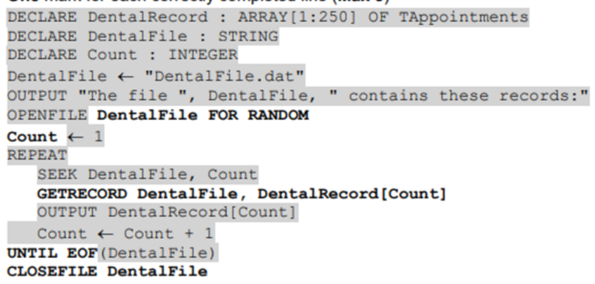

- mantissa-exponent form 
    - normalized: 
        - examples:
            - `1.0000 x 2^3` 
            - `0.0000 x 2^3`
        - be able to identify normalized and not-normalized form
        - is not normalized?
            - first two bits of the mantissa should be different for normalized number
            - because the mantissa starts with 00
    
    - when allocating less bits to mantissa
        - reduction in precision
        - as the number of bits in the mantissa has decreased
    - when allocating more bits to exponent
        - increase in range
        - as the number of bits in the exponent has increased
    - in both of the cases above, first check for the bits needed to answer the question, 
        - if less, tell: "not enough bits to store the whole binary number"

    - why 513 (>511) cannot be stored accurately as a normalized floating point number?
        - requires 11 bits to store accurately
        - reference to maximum (positive) number that can be stored = 511
        - denary 513 in binary is 1000000001
            - normalized is 0.1000000001
        - so, results in overflow
    - how store numbers greater than >511?
        - the number of bits for the mantissa must be increased
        - 11/12 bits mantissa and 5/4 bits exponent
    
    - storing a binary number as floating point number
        - good
        - bad
            - the precision of the number would be reduced
            - because the LSB of the original number has been lost (truncated)
    
    - why binary numbers stored in normalized form?
        - to store the maximum range of numbers in the minimum number of bytes
        - normalization minimises the number of leading zeros / ones represented
        - maximising the numbers of significant bits // maximising the (potential) precision of the number for the given number of bits
        - enables very large / small numbers to be stored with accuracy
        - avoids the possibility of many numbers have multiple representaions

    - when an undeflow (opposite of overflow) occurs in a binary floating point system
        - following an arithmetic/logical operation
        - the result is too small to be precisely represented in the avilable system
            - when the number of bits is not enough
            - too small for the computers allocated word size
            - to represent the binary number

- user defined data types
    - called records
    - purpose?
        - to create a new data type (from existing data types)
        - to allow data types not available in a programming language to be constructed
            - to extend the flexibility of the programming language
    - user defined types:
        - non composite data types
            - pointer data type
                - meaning
                    - used to reference a memmory location
                - examples:
                        - 1: note the **^** infront of Parts
                        ```
                        // define the reference data type 
                        TYPE Parts = (Monitor, Keyboard, Mouse)

                        // use the pointer and reference to Parts
                        TYPE SelectParts = ^Parts
                        ```
            - enumerated data type
                - meaning
                    - ordered list of possible values
                - examples:
                    - `WeekEnd` stores data about the days that are not school days:
                    ```
                    TYPE WeekEnd = (Saturday, Sunday)
                    // note, they are not "strings", write write the values inside the brackets
                    ```
        - composite data type
            - meaning?
                - a data type constructed by a progammer (not a primitive data type)
                - a data type that references at least one other data type
                - and data types can be primitive, or user defined
            - alternative examples:
                - classes
                - objects
                - sets
            - examples:
                - `ClubMeet` type stores first, last names, the days to stay home without school
                ```
                // our enumerated data type
                TYPE WeekEnd = (Saturday, Sunday)

                // composite data type
                TYPE ClubMeet
                    DECLARE FirstName: STRING
                    DECLARE LastName: STRING
                    DECLARE Holiday: WeekEnd
                ENDTYPE

                // declaring our variable
                DECLARE TestObj: ClubMeet

                // to assign values
                TestObj.FirstName <-- "Hirusha"
                TestObj.LastName <-- "Adikari"
                ```
        - other
            - variable's value should be within 1 and 10
            ```
            DECLARE Copies: 1 .. 10
            ``` 

            - array of custom given type, with index we mentioned we earlier
            ```
            DECLARE Test: ARRAY[1:Copies] OF CustomDataType
            ```



- file access
    - direct
        - suitable when
            - record is referenced by a unique address on a disk-type storage medium
    - sequential
        - suitable when
            - a bank stores its data records in ascending order of account number
        - how records are organized
            - records are stored in a particular order
            - the order is determined baxed on the value in a key field
            - records are accessed one after the other
            - records can be found by searching from the beginning of the file, record by record
            - until the required record is found or key feild is exceeded
    - serial
        - description
        
    - sequential vs serial
        - in both serial and sequential files records are stored one after the other
        - and need to be accessed one after the other
        - serial files are stored in chronological order
        - and stored in the order of the key field
        - in serial files, new records are added in the next available space / records are appended to the file
        - in sequential files, new records are intrerested in the correct position


