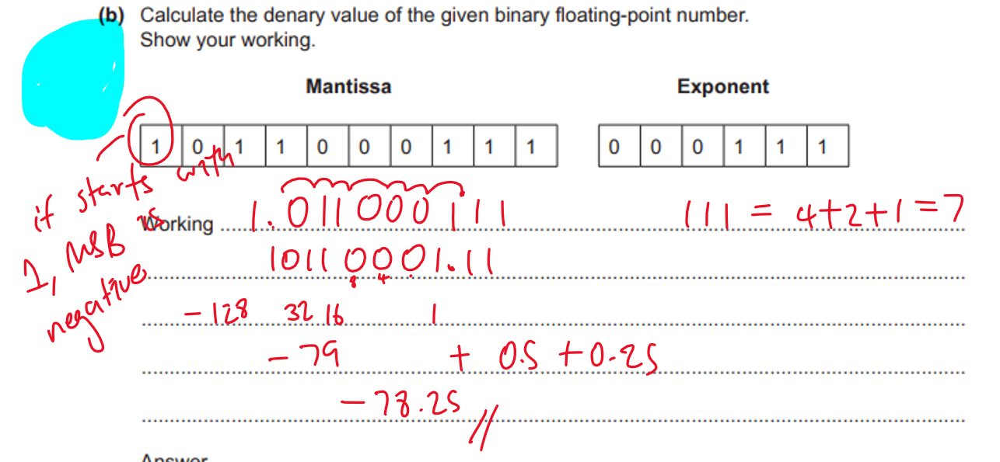
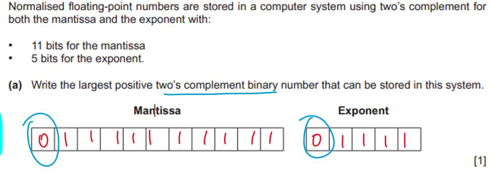
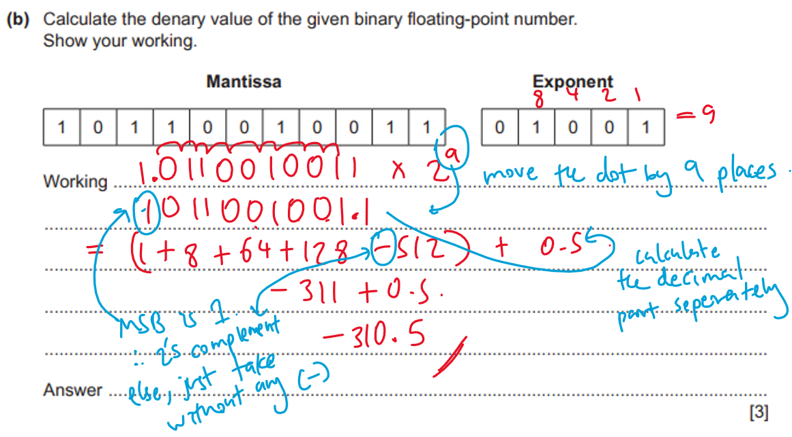
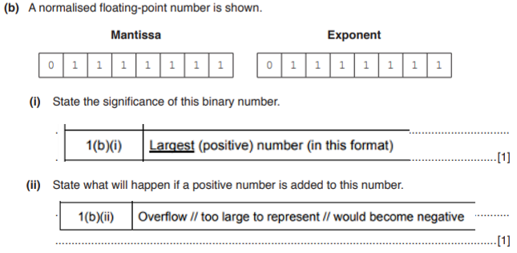
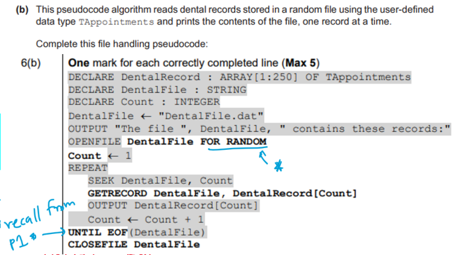

- mantissa-exponent form 
    - normalized: 
        - examples:
            - `1.0000 x 2^3` 
            - `0.0000 x 2^3`
        - why?
            - to store the maximum range of numbers in the minimum number of bytes
            - normalization minimises the number of leading zeros / ones represented
            - maximising the numbers of significant bits // maximising the (potential) precision of the number for the given number of bits
            - enables very large / small numbers to be stored with accuracy
            - avoids the possibility of many numbers have multiple representaions
        - identify normalized and not-normalized form
            - if normalized,    
                - mantissa should begin with 01 / 10
                - mantissa should not begind with 00 
        - is not normalized?
            - first two bits of the mantissa should be different for normalized number (10 / 01)
            - because the mantissa starts with 00
        - when not normalized (problems)?
            - precision is lost
            - redundant leading zeros in mantisaa
            - bits lost off right hand (least significant side)
            - multiple representations of a single number
    
    - NOTE: when converting from decimal/denery to mantissa-exponent form
        - if mantissa starts with 1 (MSB) - ( its a two's complement number )
        - eg:
        

    - bits are allocated differently to mantissa and exponent in each computer system
        - mantissa (main part)
            - more bits
                - more precise
            - less bits
                - less precise
        - exponent (power)
            - more bits
                - increase in range of numbers (that can be represented)
            - less bits
                - decrease in range of numbers (that can be represented)
        - facts:
            - when selecting how many bits for mantissa and exponent
                - the trade-off is between range and precision
    
    - in both of the cases above, first check for the bits needed to answer the question, 
        - if less, tell: "not enough bits to store the whole binary number"
        - any increany in the number of bits for the mantissa means fewer bits available for the exponent
    
    - when data representation of a number is changed (general/universal)
        - the number caulculated will change
        - the same bit pattern is for a different number
        - software may crash (if not updated)

    - numbers possible
        - largest (normal, without two's complement)
            - mantissa: 11111111
            - exponent: 1111
        - largest two's complement
            - mantissa: **0**1111111
            - note that is starts with 0
            
        - smallest
            - mantissa: 00000000
            - exponent: 0000

    - overflow
        - eg: (from a question):
            - why 513 (>511) cannot be stored accurately as a normalized floating point number with a 10-bit mantissa?\
                - requires 11 bits to store accurately
                - reference to maximum (positive) number that can be stored = 511
                - denary 513 in binary is 1000000001
                    - normalized is 0.1000000001
                - so, results in overflow
            - how store numbers greater than >511?
                - the number of bits for the mantissa must be increased
                - 11/12 bits mantissa and 5/4 bits exponent
    - underflow
        - when an underflow (opposite of overflow) occurs in a binary floating point system
        - following an arithmetic/logical operation
        - the result is too small to be precisely represented in the avilable system
            - when the number of bits is not enough
            - too small for the computers allocated word size
            - to represent the binary number
    
    - storing a binary number as floating point number
        - good
        - bad
            - the precision of the number would be reduced
            - because the LSB of the original number has been lost (truncated)
    
    - conversions 
        - refer the physical note
        - examples
            - mantissa-exponent form to denery/decimal
            





- user defined data types
    - called records
    - purpose?
        - to create a new data type (from existing data types)
        - to allow data types not available in a programming language to be constructed
            - to extend the flexibility of the programming language
    - user defined types:
        - non composite data types
            - pointer data type
                - meaning
                    - used to reference a memmory location
                - examples:
                        - 1: note the **^** infront of Parts
                        ```
                        // define the reference data type 
                        TYPE Parts = (Monitor, Keyboard, Mouse)

                        // use the pointer and reference to Parts
                        TYPE SelectParts = ^Parts

                        // if the question doesn't give the variable name but suggests a data type
                        TYPE SelectNames = ^STRING
                        ```
            - enumerated data type
                - meaning
                    - ordered list of possible values
                - examples:
                    - `WeekEnd` stores data about the days that are not school days:
                    ```
                    TYPE WeekEnd = (Saturday, Sunday)
                    // note, they are not "strings", write write the values inside the brackets
                    ```
                    - Departement stores one of three values: Sales, Tech, CustomerServices
                    ```
                    DECLARE Departement: (Sales, Tech, CustomerServices)
                    ``` 
        - composite data type
            - record
                - description
                    - collection of related items which may have different data types
                - meaning?
                    - a data type constructed by a progammer (not a primitive data type)
                    - a data type that references at least one other data type
                    - and data types can be primitive, or user defined
                
                - examples:
                    - `ClubMeet` type stores first, last names, the days to stay home without school
                    ```
                    // our enumerated data type
                    TYPE WeekEnd = (Saturday, Sunday)

                    // composite data type
                    TYPE ClubMeet
                        DECLARE FirstName: STRING
                        DECLARE LastName: STRING
                        DECLARE Holiday: WeekEnd
                    ENDTYPE

                    // declaring our variable
                    DECLARE TestObj: ClubMeet

                    // to assign values
                    TestObj.FirstName <-- "Hirusha"
                    TestObj.LastName <-- "Adikari"
                    ```
            - other composite data types:
                - arrays
                    - indexed collection of items with same data type
                - sets
                    - stores a finite number of different values that have no order 
                        - (values don't repeat)
                    - supports mathematical operations
                - lists
                    - indexed collection of items that can have different data types
                - class / struct / structure
                    - gives properties and methods for an object
                - stack 
                - queue 
                - linked list
                - dictionary
                - objects
        - other
            - variable's value should be within 1 and 10 (both start and end are inclusive)
            ```
            DECLARE Copies: 1 .. 10
            ``` 

            - array of custom given type, with index we mentioned we earlier
            ```
            DECLARE Test: ARRAY[1:Copies] OF CustomDataType
            ```


- file access
    - direct
        - suitable when
            - record is referenced by a unique address on a disk-type storage medium
    - random
        - how a file is accessed?
            - ID is hashed to give address (home location)
            - compared to ID stored at given address (home location)
            - if nothing stored, output message 'record not found'
            - if record IDs equal, then the record is found
            - if record IDs not equal, search overflow area / next record
            - until record found or whole area searched
            - if no record found, error message
        - how to add a new file?
            - ID hashed to give address
            - check if a record already stored at address
            - if nothing stored, store a new record
            - if another record already stored, search overflow data (next record)
            - until free space found or whole area searched
            - if no space, output error message
        - how to append to a file? 
            - key field is hashed to produce home location
            - if home location is free, insert record/data
            - else use overflow method to find free location to store record
            - if no free location avilable then file is full and records cannot be stored
    - sequential
        - suitable when
            - a bank stores its data records in ascending order of account number
        - how records are organized
            - records are stored in a particular order
            - the order is determined baxed on the value in a key field
            - records are accessed one after the other
            - records can be found by searching from the beginning of the file, record by record
            - until the required record is found or key feild is exceeded
    - serial
        - description
        
    - sequential vs serial
        - in both serial and sequential files records are stored one after the other
        - and need to be accessed one after the other
        - serial files are stored in chronological order
        - and stored in the order of the key field
        - in serial files, new records are added in the next available space / records are appended to the file
        - in sequential files, new records are intrerested in the correct position

    

