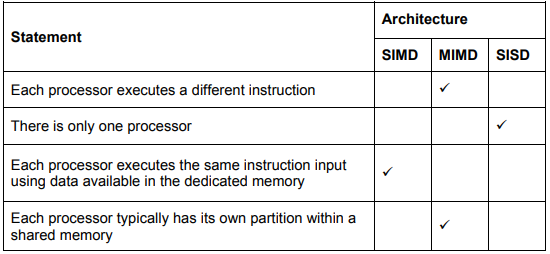
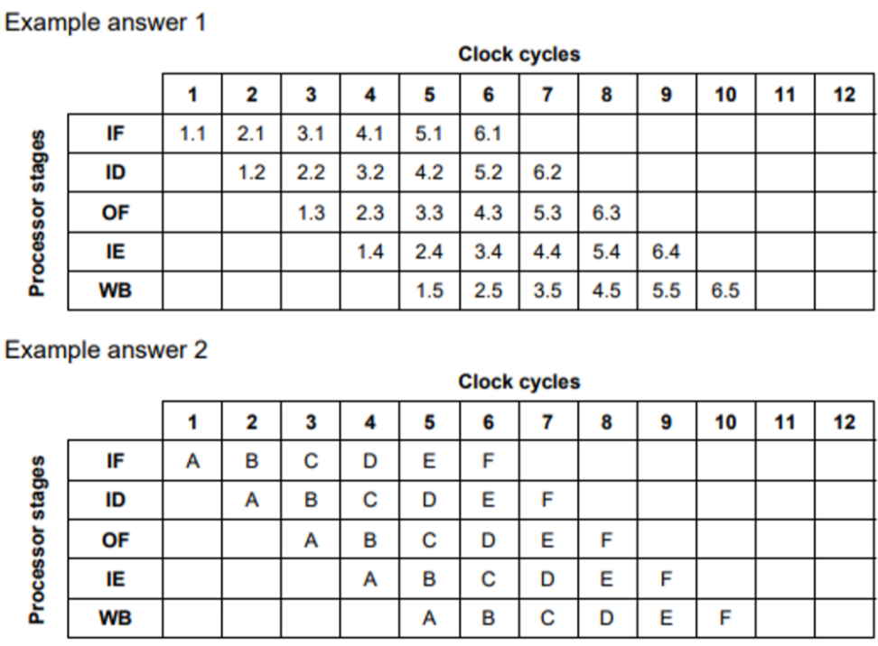
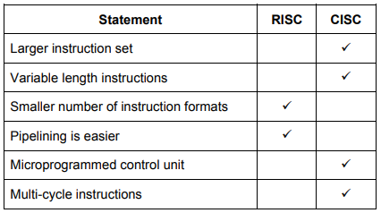
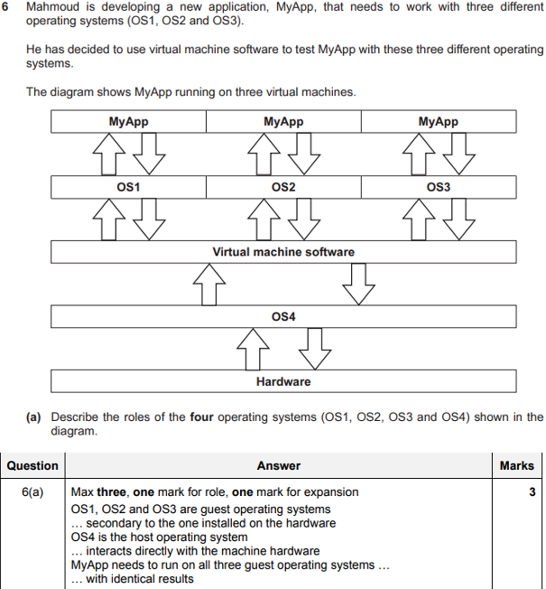

- computer architechture:

  - SIMD
    - single instruction mutltiple data
    - description:
      - many processors execute the same instruction using different data sets
    - detailed:
      - the processor has several ALUs
      - each ALU executes the same set of instructions on different sets of data at the same time
  - MISD
    - single instruction mutltiple data
    - description:
      - many processors using different instrctions use the same data set
    - detailed:
      - there are several processors
      - each processor executes different sets of instrcutions on one set of data the same time
  - MIMD
    - multiple instruction multiple data
    - description:
      - many processors using different instructions using different data sets
    - detailed:
      - there are several processors
      - each processor executes a different set of instructions
      - each processor operates on different set of data
  - SISD
    - single instruction single data
    - detailed:
      - there is only one processor
      - the processor executes one set of instructions on one set of data
  - comparison

    

- instrction sets

  - used in parallel processing:

    - RISC: Reduced Instruction Set Computer

      - describe
        - uses simple instructions
        - uses a smaller instrction set
        - uses fixed length instructions
        - instructions only reqyure one clock cycle
        - uses single cycle instructions
        - limited addressing modes
        - uses many registers
        - makes use of pipelining
        - hardwired control unit
        - uses a system where cache is split between data and instructions
      - pipelining

        - how pipelining happens during fetch-execute cycle?
          - answer 1
            - instructions are divided into 5 stages (subtasks)
              - IF - instrution fetch
              - ID - instrution decode
              - OF - operand fetch
              - IE - instruction execute
              - WB - write back result
            - each subtask is completed during one clock cycle
            - no two instructions can execute their sane stage at the same clock cycle
            - two second instruction begins in the second clock cycle, while the first instrucftion has moved on to its second subtask
            - the thirs instruction beginds in the third clock cycle while the first and second instructions move on to their second and third subtasks,respectively.
          - answer 2
            - pipelining allows seeveral instructions to be processed simulatneously
            - therefore, increasing the cpu instruction throughput
              - the number of instructions completed per unit time
            - each instruction stage / subtask is completed during one clock cycle
            - no two instructions can execute their same stage of instruction / subtask at the same clock cycle
            - eg: wguke one instruction is being decoded, the next instruction can be fetched
        - example question:

          "Complete the table to show how a program consisting of six instructions would be completed using pipelining"

          

    - CISC: Complex Instruction Set Computer

      - describe
        - uses many instruction formats
        - uses variable length instructions
        - makes uses of different addressing modes
        - uses fewer registers
        - has a large instruction set
        - requires complex circuits
        - frequently uses cache
        - instructions (converted to sub instructions that) many require many clock cycles
        - programmable control unit
        - uses fewer general purpose registers
        - uses both hardwired and microcoded control units

    - RISC vs CISC Comparison

      | what | risc | cisc |
      | --- | --- | --- |
      | registers | more | less |
      | addressing modes | less | more |
      | no. of instructions | small | large |
      | instructions complexity | simple | complex |
      | instruction cycles | single cycle instructions | multi cycle instructions |
      | instruction lengths | fixed length | variable length |
      | pipelineability | good | bad |
      | circuit complexity | less complex | more complex |
      | ram usage | more | less |
      | control unit | hard wired | programmable |
      | instruction types | instructions to only load and store to memmory | has many types to address memmory |

      

      - common description:
        - a processor with a few simple fixed length instructions that have a small number of instruction formats is called a RISC (reduced instruction set computer) processor.
        - a processor with many complex variable length instrctions that has many instrction formats is called a cics (complex instruction set computer) processor
        - instruction-level parallelism, applied to the execution of instructions during the fetch-execute cycle is called pipelining

- massively parallel computers:

  - characteristics:
    - a large number of computer processors
    - seperate computers connected together
    - simultaneously performing a set of coordinated computations
    - working together simultaneously on the same program
    - collaborative processing
    - network infrastructure
    - communicate using a message interface / by sending messages

- process management

  - sheduling
    - why? explain a need for this?
      - process sheduling allows more than one program / task to appear to be executed at the same time / enables multi-tasking and multi-programming
      - to allow high prioriy jobs to be completed first
      - to keep the cpu busy all the time
      - to ensure that all processes execute efficiently
      - and to have reduced wait times for all processes / to ensure all processes have fair access to the cpu / prevent starvation of some processes
    - routines
      - shortest job first
        - process are executed in ascending order of the amount of CPU time required
        - short processes are executed first and followed by a longer processes
        - which leads to an increased throughput
          - because more processes can be executed in a smaller amount of time
      - round robin
        - each process is served by the CPU for a fixed time (time slice)
          - so all procsesses are given the same priority
        - starvation doesn't occur
          - because for each round robin cycle, every process is given a fixed time to execute
      - first come first served
        - no complex logic, each process request is queued as it is recieved and executed one by one
        - starvation doesn't occur (because every process will eventually get a chance to run)
        - less processor overhead

- memmory management

  - virtual memmory
    - explanation:
      - disk / secondary storage is used to extend the ram/memmory available
      - so the cpu appears to be able to access more memmory space than the available RAM
      - only the data in uyse needs to be in the main memmor so data can be swapped between the RAM and virtual memmory as necessary
      - virtual memmory is created temporarily
      - data is swapped between RAM and the disk
    - disk thrashing
      - pages are required back in RAM as soon as they are moved to disk
      - there is continous swapping (of the same pages)
      - no useful processing happens
      - deadlock
        - because pages that are in RAM and on the disk are inter-dependent
        - nearly all processing time is used for swapping pages
  - paging
    - description
      - paging allows the memmory to be divided into fixed size blocks
      - the OS divides the memmory into pages
    - how paging is used to manage memmory?
      - divide memmory / RAM into frames
      - divide virtual memmory into blocks of same size called pages
      - frames / pages are a fixed size
      - set up page table to translate logical to physicall addresses
      - keep track of all free frames
      - swap pages in memory with new pages from a disk when needed
    - best algorithms for this process:
      - first in first out
      - least recently used page
      - least used page
  - segmentation
    - divides the emmory into variable sized blocks
    - the compiler is responsible for calculating the segment sizes
  - paging vs segmentation
    - access times for paging is fatser than for segmentation

- virtual machines 
  - what?
    - emulation of a computer system / hardware / software
    - using a host computer system
    - using guest OS for emulation
  - why?
    - emulate a new computer system
  - role of virtual machine software
    - create / delete / manage virtual machines
    - translate instructions used by guet OS to that required by the host OS
    - hardware emulation
    - protecting each virtual machine
      - so several instances can be tested together
  - good:
    - detailed:
      - new system can be tried on different virtual hardware
        - without the need to purcahse the hardware
          - easier to recover if software emulating the new computer causes system crash (with snapshots)
        - as VM provides protection to other software
        - and can restor/rollback and snapshot of the VM
      - emulate the programs for the new computer system that are not compatible with the host computer / operating system by using the guest OS on the old computer
      - more than one new computer system can be emulated
        - this allowss multiple OS to co-exist on a sigle computer
      - only one set of hardware is required
        - reduces costs as no need to setup more than one computer
    - short
      - multiple VMs can be run on the same computer simultaneously
      - different instruction set architechtures can be emulated on a single computer
      - a vm can crash without affecting the host machine
      - easy to recover the vm if software causes system to crash using snapshots
      - there are security benefits
        - if we run a virus by accident, it will only infect the virtual machine
      - cost savings due to not needing to purchase extra hardware
      - can run legacy applications that are currently incompatible
      - provided protection to host OS from alfunctioning software
  - bad:
    - detailed:
      - VM may not be able to emulate the new hardware
        - because this hardware may have been developed since the virtual machine was developed
        - using virtual machine means execution of extra code
          - a virtual machine machine might not be as efficient
          - resources and processor time are shared
          - processing time increased
          - performance degrades
        - use of a virtual machine increases the maintenance overheads
          - because both host system and the virtual machine must be maintained.
    - short:
      - a vm has poor performance because of the extra load on the host computer
      - performance of the guest system cannot be adequaltely measured
      - a virtual machine may be affected by any weakness of the host machine
      - costly and complex to maintain / implement / manage
      - increases maintainance overhead
      - cannot emulate some hardware.
