# Chapter 19 - Logic circuits and Boolean algebra

- boolean algebra
    - laws
    
    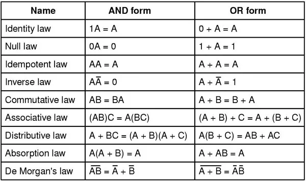
    
    - sample question + IMPORTANT note
    
    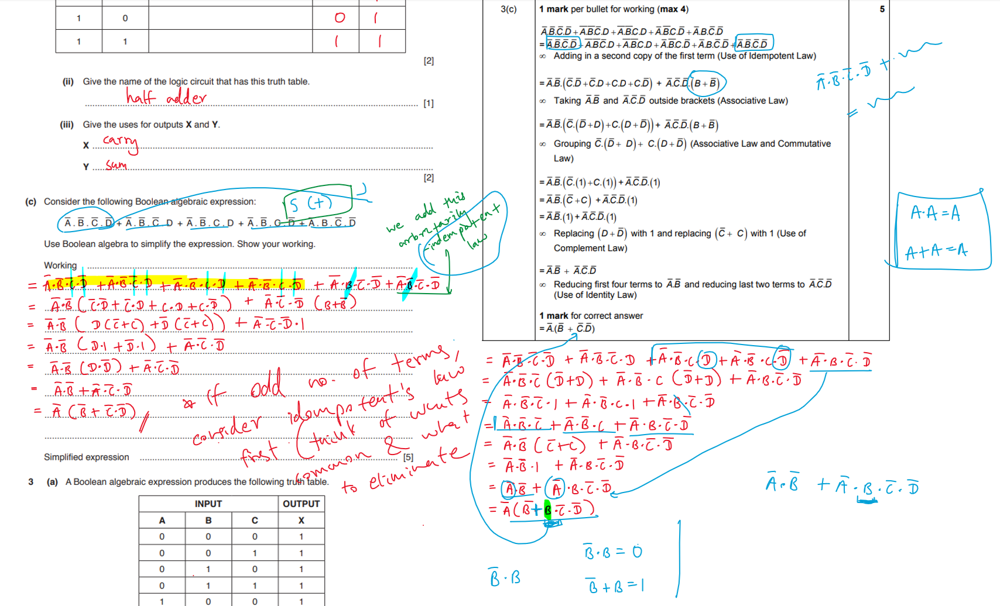

    - similar question to above important note

    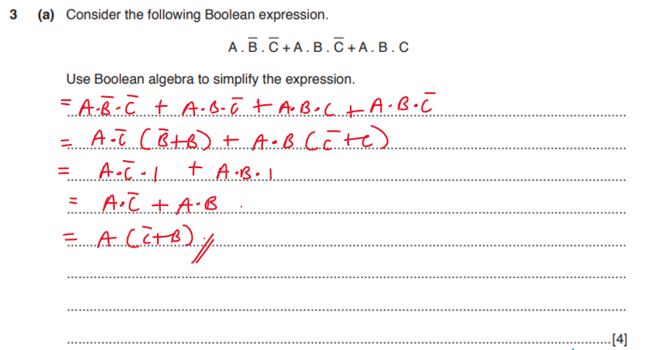

questions from half adder:
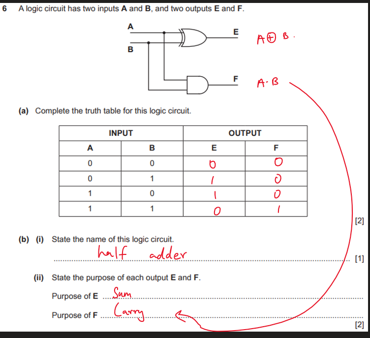

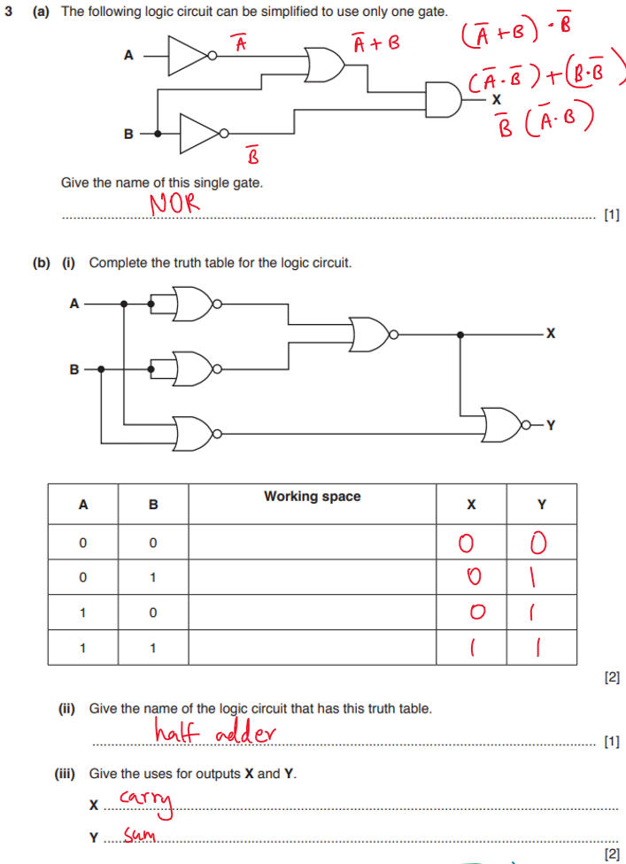

questions from full adder:
    - majority of the questions were about the full adder
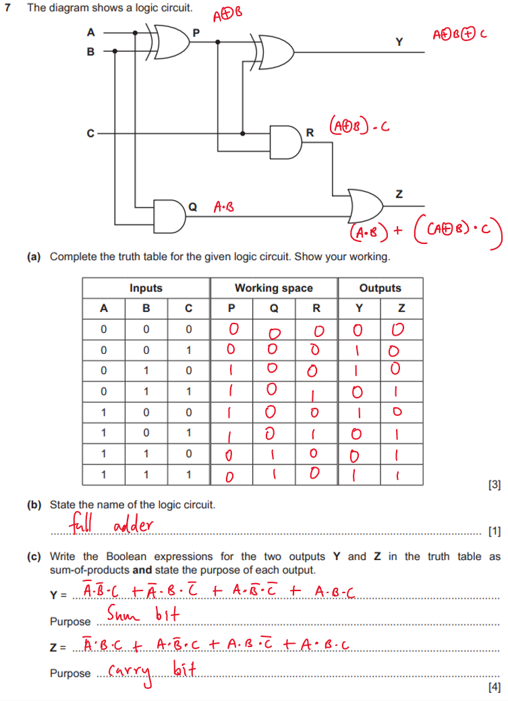

- flip flops
    - describe
        - circuit
        -  with two states
        - used for data storage elements
        - to store 1 bit of data
    - why / purpose
        - to store a binary digit / single bit
    - description long
        - a flip-flop is a logic circuit
        - it has a two stable states
        - a flip-flop is used for storing 1 bit of data / memmory / registers
        - there are different types of flip-flop, for example: JK and SR
    - types
        - SR flip flop
            - has undefined state
            - remember how to draw this
            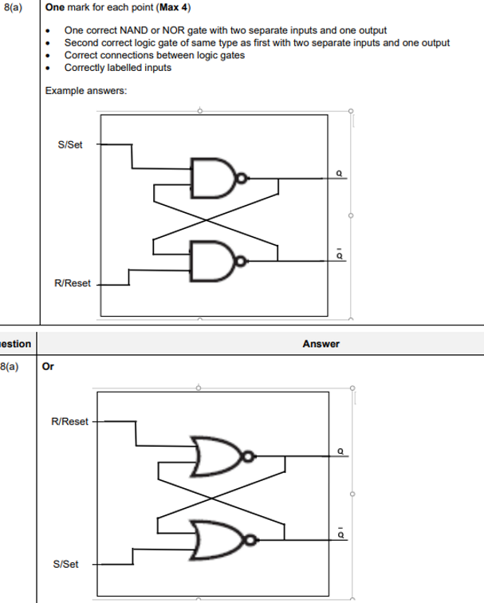
        - JK flip flop
            - is stable
            - has a clock pulse

- karnaugh maps
    - always circle only even number of 1's next to each other
    - remeber the roll kind thing
    - examples:
        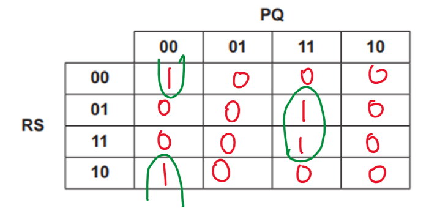

        - in this case, we fully neglect output X

        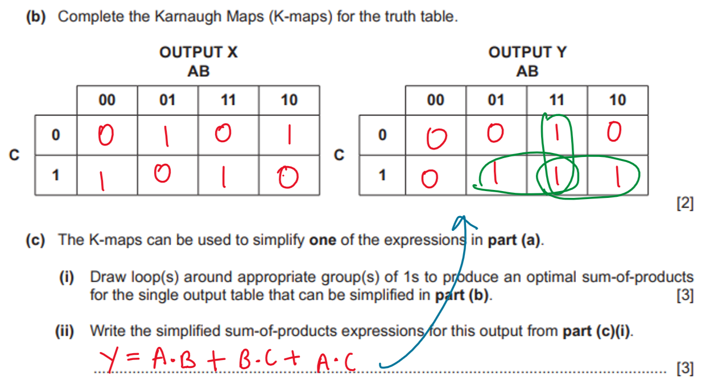

        - wrap horizontally

        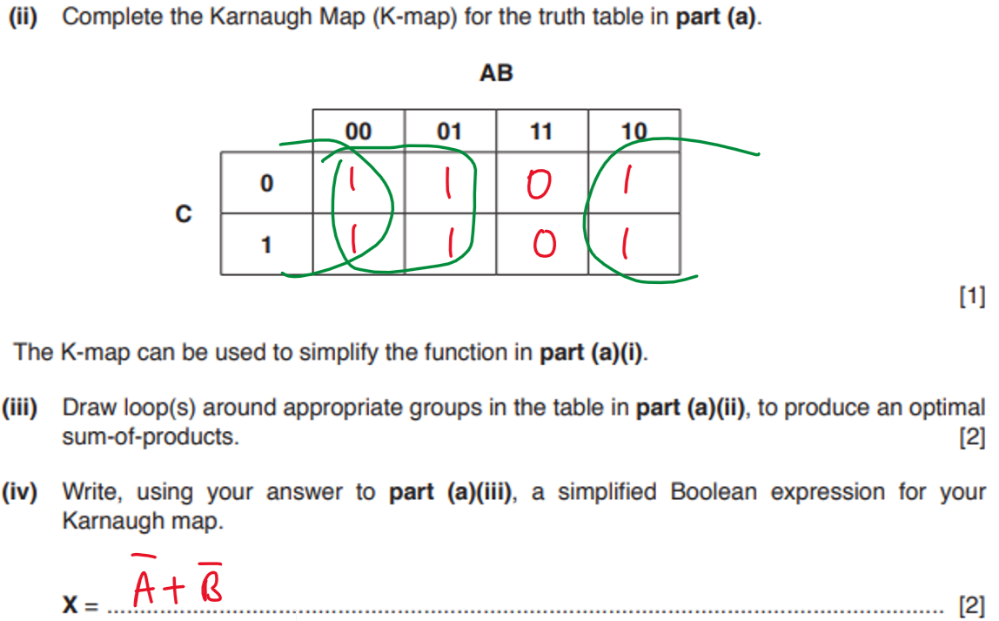

        - when 1s in a square shape

        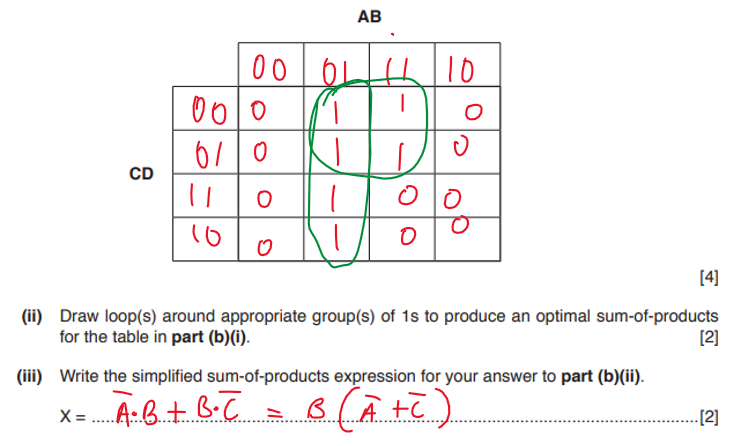

        - more square shape examples

        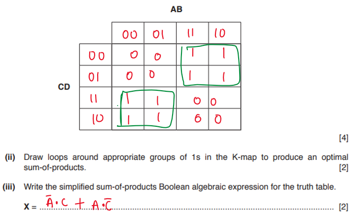