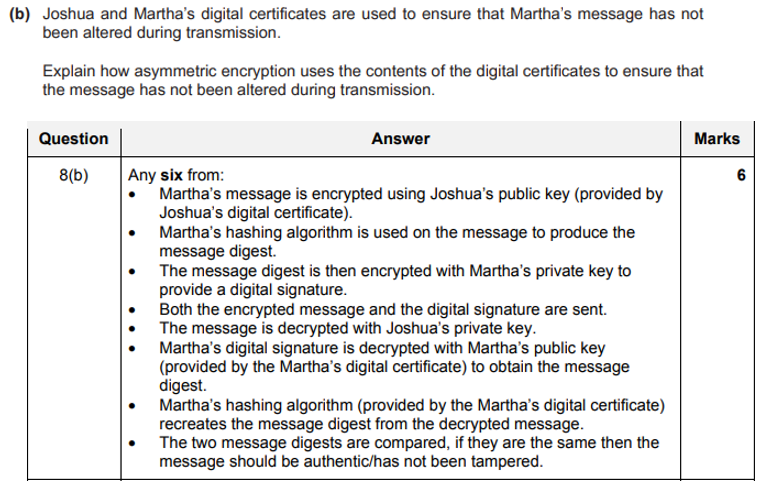

- plain text
  - original data to be transmitted as a message
  - encrypted into cipher text

- cipher text
  - result of encryption that is tranmsitted to the recipient

- cryptography

  - key cryptography
    - why use?
      - to ensure the message is authentic // came from a trusted source
      - to ensure that only the intended reciever is able to udnerstand the message
      - to ensure the message has not been altered during transmission
      - non repudiation, neither the sender or the reciever can deny the transmission that occured
    - two methods:
      - symmetric
        - description
          - a single is used
          - for both encryption and decryption
        - good
        - bad
          - key has to be exchanged securely
          - once compormised the key can be used to decrypt the both the sent and recieved messages
          - cannot ensure non-repudiation (proof of integrity and origin of data)
      - asymmetric
        - describe
          - the message to be sent is encrypted using reciepient's public key
          - the message is decrypted using the reciepient's private key (after it has been devlivered securely)
        - process
          - two matching keys are used
          - one public and one private
          - obtain the public key of reciepient
          - before the message is sent
          - message is encrypted (by the sender) using public key of the reciever
          - when the message is recieved by reciepient
          - the message is decrypted (by the reciever) using the private key of the reciever
        - why
          - private key does not need to be tranmsitted
        - purpose
          - to provide better security
          - by using 2 different keys (a public key and private key)
          - one of the keys is used to encrypt the message
          - the **matching key** is used to decrypt the message
        - good
          - increased message security as one key is private
          - allows message authentication
          - allows non-repudiation
          - detects tampering
          - more secure
          - larger keys can be used (2048 bits compared to 256 bits)
        - bad
          - slow
          - complex
        - how to ensure its a verified message
          - sender creates the message digest
          - reciever re-creates this message digest
          - if they match, message has been verified 
        - private key
          - decrypt
          - what
            - private key is the unpublished key that is never transmitted anywhere
            - it has a matching public key
            - it is used to decrypt data that was encrypted with its matching public key
        - public key
          - encrypt
        - public key vs private key
          - similarities
            - both used in asymmetric encryption
            - as a pair of keys is required 
            - public key is used to encrypt and the private key is used to decrypt the message
          - differences
            - private key only know to owner of the key pair
            - the public key can be distributedd to anyone
            - when messages are sent to the owner of a public key, they are encrypted with the owners public key
            - so they can only be decrypted by the owner's private key
            - message digests are encrypted with the private key of the sender to form a digital signature
            - messages are ecnrypted with the public key of the reciver
      - symmetric vs asymmetric
        - symmetric encryption uses a single key and aysmmetric encryption uses a pair of keys
        - the symmetric single key is used by all, wheras only one of the keys for asymmetric encryption is available to everyone, the private key is always kept secret (only the public key is publicly available)
        - so, asymmetric is more secure
        - the risk of compormise is higher with symmetric encryption and asymmetric encryption is more secure
        - symmetric cryptography is a simple process that can be carried out quickly, but asymmetric encryption is more secure
        - the length of the keys in symmetric encryption are (usually) shorter than those for asymmetric encryption (128/256 bits vs 2048 bits)
  - quantam cryptography
    - what?
      - to produce virtually unbreakable encryption system
      - using the principles of quantam mechanics (properties of photons)
      - detects eavesdropping
        - because the properties of photons change (if eavesdropped)
      - to protect security of data transmitted over fibre optic cables
      - to enable the use of longer keys
    - good
      - provides security based on laws of physics, rather than mathematical algorithms, so, more secure
      - to protect the security of data transmitted over fibre optic cables
      - virtually unhackable
      - the perofmance of quantam cryptography is continuously improved, making it suitable for most valuable government/industral secrets
      - longers keys can be used
      - any eavesdropping can be identified
      - integrity of the key once transferred can be gauranteed (cannot be copied and decrypted at a later date)
      - longer/more secure keys can be exchanged
    - bad
      - lacks many vital features like digital signatures, certified email, etc...
      - high cost of purcahsing / maintaining equipment required
      - limited range
      - error rates are high as technology is still being developed.
      - required dedicated fibre optic line and specialist hardware
      - cost of dedicated fibre optic line and specialist hardware is expensive
      - polarisation of light can change during transmission
        - polarisation of light may be altered whilst travelling down fibre optic cables
      - allows criminals and terrorists to hide their communications

- digital certificates
  - what?
    - used to prove the ownership of a public key
    - an electronic certificate from a trusted authority that ensures authentication
  - encryption method produced by digital certificates that can be used by anyone?
    - public key
  - how a digital certificate is obtained
    - answer 1
      - enquiry made to certificate authority (CA)
      - enquirer's details checked by CA
      - if enquirer detauked verified by CA, then public key is agreed
      - CA issues certificate that includes the enquirer's public key
      - encrypting data sent to/by CA with the CA's public/private key
    - answer 2
      - the organization requests a certificate from the CA
      - the organization may send their public key to CA
      - the organization gathers all the information required by the CA in order to obtain their certificate, which included information to prove their identity
      - the CA veritified the organization's identity
      - the CA issues the certificate including the organization's public key (and other information)
  - not been altered:
    
  - description
    - contains public key of owner
    - obtained from CA
    - before private message is sent to the owner of the DC, the key is used to encrypt the message
    - the digital signature is also sent
    - the message is hashed to produce a message digest
    - which is then encrypted with the sender's private kay to obtain the digital signature
  - items included in digital signature
    - serial number
    - name of organization
    - date valid from / to
    - signature to verify it came from the issuers
    - name of issuer
    - purpose of the public key
    - thumprint algorithm
    - thumprint for the hash
    - CA digital signature
    - a hashing algorithm

- digital signature
  - how its produced
    - the message is hashed (with the agreed hashing algorithm)
    - to produce a message digest
    - the message digest 
      - is then encrypted 
      - with the sender's private key
  - why?
    - authentication: to make sure the message is from a trusted source
    - non-repudiation: sender cannot deny having sent that message
    - message has not been tampered with during transmission
  - how it can be used to check weather the message is unaltered
    - the message together with the ditgital signature is decrypted using the reciever's private key
    - the digital signature recieved is decrypted with the sender's public key to recover the message digest sent
    - the decrypted message recieved is hashed with the agreed hashing algorithm to produce the message digest of the message recieved
    - the two message digests are compared
    - weather they are the same, and if it is, this means that the message has not been altered

digital signature vs digital certificate
  - similarities
    - both used for authentication
    - both are unique to the owner
    - use owner's public key
    - make use of hashing algorithms
  - differences
    - certificate obtained from issuing authority
    - signature created from a message
    - certificate provides authentication of owner
    - signature used to authenticate messages that are send by the owner
    - certificate remains unchanged whilst its is valid
    - new signature created for every message
    - only certificate provides extra information
    - only signature makes use of private key

data transmission encryption:
  - how both SSL or TLS helps to keep information secure
    - computer checks the digital certificate of the online shop's website
    - if digital certificate is invalid, his computer rejects the website
    - if valid, session is created // the transaction can continue
    - the encryption algorithms to bee used are agreed
    - the session keys to be used are generated
    - the session key is used to encrypt the data sent
  - TLS
    - how/explain
      - a protocol with two layers
      - handshake and record
      - a tls key certificate is used for authentication
      - handshakes use aysmmetric encryption
      - to generate agreed parameters
      - establish a shared session key
      - the shared session key provides symmetric cryptography for
      - sending and recieving data (record layer)
      - at end of session, all parameters are erased
    - when/why use?
      - browsers accessing secure websites. eg: bank transactions
      - VPNs
      - Email
      - VOIP
  - SSL
    - how a connection is established?
      - browser requests that the server identified itself
      - server sends a copy of digital certificate
      - containing a public key
      - browser checks the certificate
      - against a list of trusted certificate authorities
      - if the browser trusts the certificate
      - a symmetric session is created
      - this is (by the browser) encrypted using the server's public key and sent to the server
      - server decrypts the symmetric session key
      - using its private key
      - server and browser now encrypts all tranmsitted data with the session key
    - when setting up a connection
      - browser requests that the server identifies itself
      - server sends a copyu of its SSL certificate and its public key
      - browser checks the certificate against a list of trusted certificate authorities
      - if the browser trusts the certificate, it creates, encrypts and sends the server a symmetric session key using the server's public key
      - server decrypts the symmetric session key using its private key
      - server sends the browser an acknowledgement, encrypted with the session key
      - server and browser now encrypt all tranmsitted data with the session key

- other
  - unidentified email
    - problems
      - a virus could be launched
      - phishing could be attempted
      - spyware could be installed on lara's computer
      - lara's personal details could be sent to a malicious third party
  - malware
    - how to restrict
      - use a firewall to enforce rules for downloading data
      - use antivirus software to quarantine viruses
      - not clicking on links in emails from unkown source

