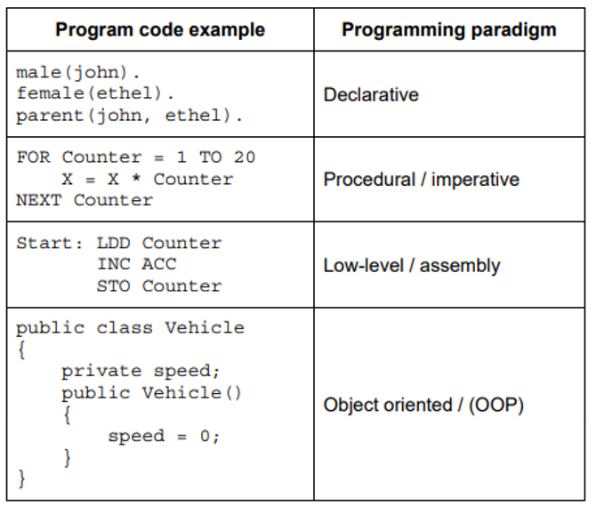

- Programming Paradigms
    - Imperative
        - description
            - programs with an explicit sequence of commands that update the program state
            - with or without procesure calls
        - meaning
            - languages use variables
            - which are changed using (assignment statements)
            - they rely on a method of repetition/ iteration
            - statements provide a sequence of commands for the computer to perform
            - in the order written
            - each line of code changes something in the program run
    - Declarative
        - description
            - Programs that specify the desired result rather than how to get to it.
        - meaning
            - instructs a program on what needs to be done instead of how to do it
            - using facts and rules
            - using queries to satisfy goals
            - can be logical or functional
                - logical: states a program as a set of logical relations
                - functional: constructed by applying functions to arguments / uses a mathematical style 
    - Low Level
        - description
            - programs using the instruction set of a processor
    - Object Oriented Programming
        - keywords
            - properties
                - data items // attributes
                - data types // characteristics
                - defined in a calss
            - methods
                - the procedures / functions programmed instructions in a class / super class / base
                - implementing the behvaiours
                - that act on the properties / attributes
        - Concepts
            - Inhertance
                - methods and properties contained in one class (super/parent class)
                - are made available to / reused by another class (child class)

    

- Recursion
    - fearures
        - must have a base case (stopping condition)
        - must have a general case
        - which calls itself (recursively) - defined in terms of itself
        - which changes its state and moves towards the base case
        - unwinding can occur once the base case is reached
    - why use stack to implement recursion?
        - the stack is a LIFO data structure
        - each recursive call is pushed onto the stack
        - and is then popped as the function ends
        - enables backtracking / unwinding
        - to maintain the required order


- Abstract Data Types - ADTs
    - Stacks
        - Push
            ```python
            FUNCTION Push(NewData: INTEGER) RETURNS STRING
                IF StackFull() THEN                         # add only if not full
                    RETURN "The stack is full!"
                ELSE
                    TopOfStack <- TopOfStack + 1            # increment top-of-stack pointer
                    ArrayStack[TopOfStack] <- NewInteger    # store value in top
                    RETURN "Item added"
                ENDIF
            ENDFUNCTION
            ``` 
    


