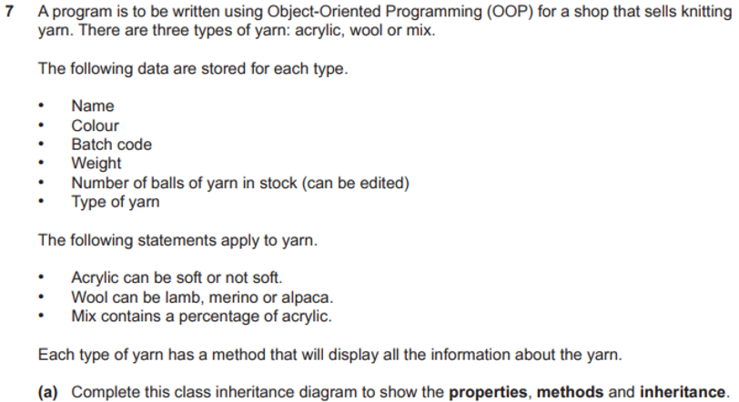
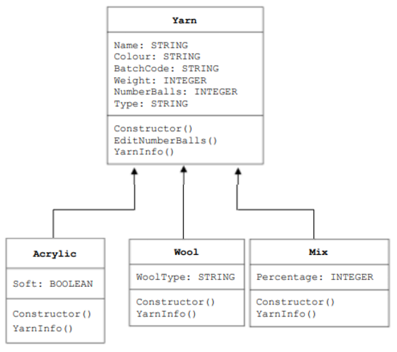
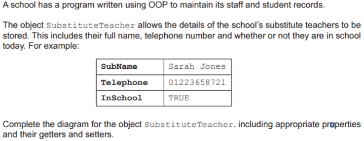
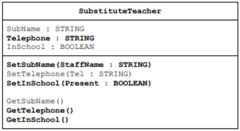

- Programming Paradigms
    
    - Imperative
        - description
            - programs with an explicit sequence of commands that update the program state
            - with or without procedure calls
        - meaning
            - languages use variables
            - which are changed using (assignment statements)
            - they rely on a method of repetition/ iteration
            - statements provide a sequence of commands for the computer to perform
            - in the order written
            - each line of code changes something in the program run
    - Declarative
        - description
            - Programs that specify the desired result rather than how to get to it.
        - meaning
            - instructs a program on what needs to be done instead of how to do it
            - using facts and rules
            - using queries to satisfy goals
            - can be logical or functional
                - logical: states a program as a set of logical relations
                - functional: constructed by applying functions to arguments / uses a mathematical style 
    - Low Level
        - description
            - programs using the instruction set of a processor
    - Object Oriented Programming
        - keywords
            - properties
                - data items // attributes
                - data types // characteristics
                - defined in a class
            - methods
                - the procedures / functions programmed instructions in a class / super class / base
                - implementing the behaviors
                - that act on the properties / attributes
            - getter
                - method used to return the value of a property
            - setter
                - method used to set/update the value of a property
        - Concepts
            - Abstraction
                - the ability to define classes and methods that represent the common structure and behavior of a group of objects, without providing specific implementation details for each object
                - the ability to hide complex implementation details and show only the necessary features of an object
            - Inheritance
                - methods and properties contained in one class (super/parent class)
                - are made available to / reused by another class (child class)
                - enables the defining of a new class that inherits a parent class
            - Polymorphism
                - allows the same method to take on different behaviors depending on which class is instantiated.
                - methods can be redefined for derived classes.
            - Encapsulation
                - process of putting data and methods together as a single unit 
                - putting properties and methods inside a class
                - ensures sensitive data is hidden from users by hiding values of a structure object inside a class
        - Pseudocode
            - example 1:

                ```python
                CLASS Car # class declaration 

                    # class instance variables
                    PRIVATE Model: STRING
                    PRIVATE FuelType: STRING
                    
                    # constructor: `PUBLIC PROCEDURE NEW`
                    PUBLIC PROCEDURE NEW(CarModel: STRING,  CarFuelType: STRING)
                        Model <- CarModel
                        FuelType <- FuelType 
                    ENDPROCEDURE

                    # idk
                    getFuel()
                    getModel()

                ENDCLASS
                ```
        - Class Inheritance diagrams
            - example 1
                
                
            - example 2
                
                
    

- Recursion
    - features
        - must have a base case (stopping condition)
        - must have a general case
        - which calls itself (recursively) - defined in terms of itself
        - which changes its state and moves towards the base case
        - unwinding can occur once the base case is reached
    - why use stack to implement recursion?
        - the stack is a LIFO data structure
        - each recursive call is pushed onto the stack
        - and is then popped as the function ends
        - enables backtracking / unwinding
        - to maintain the required order


- Abstract Data Types - ADTs
    - Stacks
        - Push
            ```python
            FUNCTION Push(NewData: INTEGER) RETURNS STRING
                IF StackFull() THEN                         # add only if not full
                    RETURN "The stack is full!"
                ELSE
                    TopOfStack <- TopOfStack + 1            # increment top-of-stack pointer
                    ArrayStack[TopOfStack] <- NewInteger    # store value in top
                    RETURN "Item added"
                ENDIF
            ENDFUNCTION
            ``` 

- Algorithms
    - Searching
        - Linear Search [ O(n) ]
        - Binary Search [ O(log n) ]
            - requirement
                - list should be already sorted
            - how to perform
                - find the middle item
                - check the value of the middle item in the list to be searched
                - if equal item searched for is found
                - if this is not equal / greater / less than the item searched for 
                - discard the half of the list that does not contain the search item
                - repeat the above steps until the item searched for is found
                - or there is only one item left in the list (and nothing else to be searched for)
            - how perform changes when theres more items in the array?
                - increases the time to search the list increases
            - code

                ```python
                # Iterative Binary Search Function
                # It returns index of x in given array arr if present,
                # else returns -1
                def binary_search(arr, x):
                    low = 0
                    high = len(arr) - 1
                    mid = 0
                
                    while low <= high:
                
                        mid = (high + low) // 2
                
                        if arr[mid] < x: # If x is greater, ignore left half
                            low = mid + 1
                
                        elif arr[mid] > x: # If x is smaller, ignore right half
                            high = mid - 1
                        
                        else: # means x is present at mid
                            return mid
                
                    
                    return -1 # then the element was not present
                ```    

- Time Complexities
    - summary

        | Order of Growth | Example                                           | Explanation                                                                                                            |
        |------------------|---------------------------------------------------|------------------------------------------------------------------------------------------------------------------------|
        | `O(1)`             | `GetFirstItem(List: ARRAY)`                       | The complexity of the algorithm does not change regardless of the data set size.                                      |
        | `O(n)`             | Linear search<br/>Bubble sort on a sorted list     | Linear growth - Time complexity increases linearly with the size of the data set.                                      |
        | `O(log₂n)`         | Binary search                                     | The total time taken increases as the data set size increases, but each comparison halves the data set. So, the time taken increases by smaller amounts and approaches constant time. |
        | `O(n²)`            | Bubble sort<br/>Insertion sort                     | Polynomial growth - Common with algorithms that involve nested iterations over the data set.                            |
        | `O(n³)`            | Deeper nested iterations                          | Polynomial growth - Deeper nested iterations will result in O(n³), O(n⁴), and so on.                                   |
        | `O(2ⁿ)`            | Recursive calculation of Fibonacci numbers        | Exponential growth - Time complexity grows exponentially with the size of the data set.                                 |

    - what is meant by `O(log n)`
        - is a time complexity that uses logarithmic time
        - the time taken goes up linearly as the number of items rises exponentially
        - O(log n) is the word scenario time complexity


- Other
    - why exception handling?
        - to trap some runtime errors
        - to prevent a program halting unexpectedly
        - to produce meaningful error messages for these errors
        - example: divide by zero, file not found

