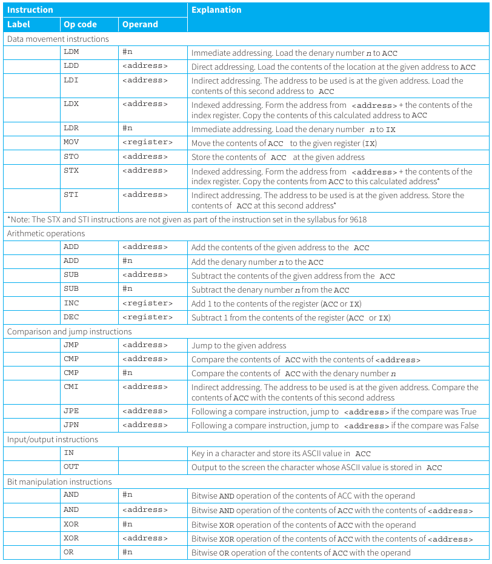
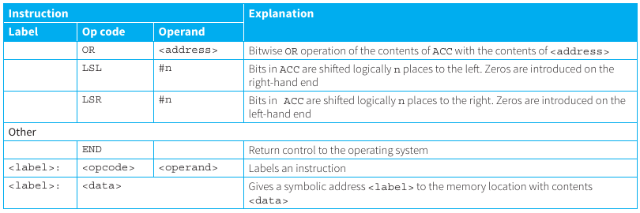
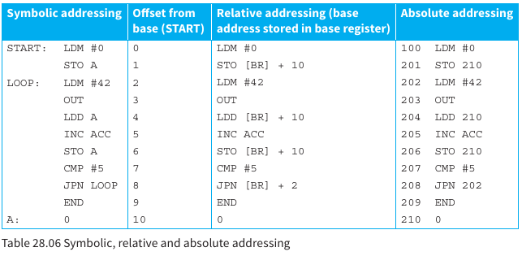

## Our instruction set

*"An instruction set architecture is a part of the abstract model of a computer, which generally defines how software controls the CPU. A device that executes instructions described by that ISA, such as a central processing unit, is called an implementation"* - [Wikipedia](https://en.wikipedia.org/wiki/Instruction_set_architecture)

Refer to Chapter 6 in P1 for additional information.

Below is the instruction set that we will be working with:




In the assembly code in this chapter:
- `ACC` denotes the Accumulator
- `IX` denotes the Index Register
- `#` denotes immediate addressing
- `B` denotes a binary number, e.g. B01001010
- `&` denotes a hexadecimal number, e.g. &4A
- `<address>` can be an absolute address or a symbolic address.

An address can be **absolute (a number)** or **symbolic (a label)**.

## Symbolic Addresses

A label is a symbolic name for the memory location that it represents. 

You can treat it like a variable name

The assembler will allocate absolute addresses during the assembly process.

## Problem Solving

### Assignment

#### Assign Value

- Pseudocode:
    ```
    A <- 34
    ```

- Assmebly: To store a value in a memory location, the value must first be generated in the accumulator.
    ```
    LDM #34
    STO A
    ```

#### Increment

- Pseudocode:
    ```
    B <- B + 1
    ```

- Assmebly: To increment the value stored at a memory location: first load the value into the accumulator, increment the value and then store the contents of the accumulator back to the memory location.
    ``` 
    LDD B
    INC ACC
    STO B
    ```

#### Add another Variable

- Pseudocode:
    ```
    B <- B + A
    ```

- Assmebly: To calculate a value: load the first value from a memory location into the accumulator, then add the value stored at the second memory location to the accumulator and then store the contents of the accumulator to the required memory location.
    ```
    LDD B
    ADD A
    STO B
    ```

#### Negative Value

- Pseudocode:
    ```
    A <- -A
    ```

- Assmebly: doing `XOR` with `11111111` to get the ones complement and then adding `1` to get the two's complement.
    ```
    LDD A
    XOR #&FF
    INC ACC
    STO A
    ```

- Assembly: set the ACC to zero and then subtract the value from the ACC and store it back in the original address
    ```
    LDM #0
    SUB A
    STO A
    ```

<details>
<summary>Summary</summary>

| Pseudocode | Assembly Code | Explanation |
| - | - | - |
| `A <- 34` | `LDM #34`<br/>`STO A` | Assign value to A |
| `B <- B + 1` | `LDD B`<br/>`INC ACC`<br/>`STO B` | Increment value of B |
| `B <- B + A` | `LDD B`<br/>`ADD A`<br/>`STO B` | Add A to B |
| `A <- -A` | `LDD A`<br/>`XOR #&FF`<br/>`INC ACC`<br/>`STO A`<br/> **Alternative Method:** <br/>`LDM #0`<br/>`SUB A`<br/>`STO A`<br/> | `XOR` with `11111111`to produce onces complement and add 1 (twos complement) |

</details>

### Selection

#### if

- Pseudocode:
    ```
    IF A = 0 THEN
        B <- B + 1
    ENDIF
    ```

- Assembly:
    ```
            LDD A       ; load A
            CMP #0      ; is A = zero
            JPN ENDIF   ; if comparison is false, skip
    THEN:   LDD B       
            INC ACC     ; increment B
            STOP B
    ENDIF:  ...
    ```

#### if-else

- Pseudocode:
    ```
    IF A=B THEN
        OUTPUT "Y"
    ELSE
        OUTPUT "N"
    ENDIF
    ```

- Assembly:
    ```
            LDD A
            SUB B       ; do a-b
            CMP #0      ; if a-b=0?
            JPN ELSE    ; skip if false
    THEN:   LDM #89     ; ascii code of "Y"
            OUT         ; 
            JMP ENDIF   ; PLEASE include this only in THEN: part
    ELSE:   LDM #78     ; ascii code of "N" 
            OUT         ; 
    ENDIF:  ...
    ```

### Repitition

#### repeat-until

- Pseudocode:
    ```
    A = 0
    REPEAT
        OUTPUT "*"
        A <- A + 1
    UNTIL A = 5
    ```

- Assembly:
    ```
            LDM #0
            STO A
    LOOP:   LDM #42
            OUT
            LDD A
            INC ACC
            STO A
            CMP #5
            JPN LOOP
    ```


### Repitition

#### Input a Character

- Pseudocode:
    ```
    INPUT A
    ```

- Assembly:
    ```
    IN
    STO A
    ```

#### Output a String

- Pseudocode:
    ```
    OUTPUT B
    ```

- Assembly: 
    
    To output a string of characters stored in consecutive locations, starting at location labelled B, a loop and indexed addressing are used

    ```
            LDM #-1
            MOV IX
    LOOP:   INC IX
            LDX B
            OUT
            CMP #13
            JPN LOOP
    ```

    The first time round the loop the index register is 0 and the character in memory location B will be loaded into the accumulator and output to the screen. Then a check is made for the end of the string (the carriage return character with ASCII code 13). If it is not the end of the string, jump back to the beginning of the loop. 
    
    To output a number, the number must first be changed into its equivalent string and stored in consecutive memory locations. Then the above method can be used.

#### Input a String

- Pseudocode:
    ```
    INPUT B
    ```

- Assembly: 

    Store a string of characters input from the keyboard into consecutive memory locations starting from A.

    ```
            LDM #-1
            MOV IX
    LOOP:   INC IX
            IN
            STX A
            CMP #13
            JPN LOOP
    ```

    Note: The STX instruction is not given as part of the instruction set in the syllabus for 9618 (from now on referred to as the 9618 instruction set). This means a string can not be saved with the 9618 instruction set.

## Absolute Addressing

An absolute address is the numeric address of a memory location. A program using absolute addresses cannot be loaded anywhere else in memory. 

- eg: `LDD 120`, `STO 150` where 120 and 150 are memmory locations/addresses.

## Relative Addressing

*( to recall from Chapter 6 from P1, this is the addressing mode with the offset thing )*

Some assemblers produce relative addresses, so that the program can be loaded anywhere in memory.

Relative addresses are addresses relative to a base address, for example the first instruction of the program. 

When the program is loaded into memory the base address is stored in a **base register: `BR`**. 

Instructions that refer to addresses then use the value in the base register, modified by the offset. For example, `STO [BR] + 10` will store the contents of the accumulator at the address calculated from **(contents of the base register) + 10**. 



- In the above image, `BR` (Base Register) is `0`. A is in after `10` locations from the `BR`, so `A` can be reffered to as `[BR] + 10`


It is very important that, at the end of the program, control is passed back to the operating system. Otherwise the binary pattern held in the next memory location will be interpreted as an instruction, leading the processor to crash. Use the `END` instruction to do that.

The instruction `END` signals the end of the program instructions.


## Indirect Addressing

Useful if the memory address to be used in an instruction is changed during the execution of the program. This goes beyond the syllabus.

- eg: when programming subroutines to which parameters are passed by reference. 

