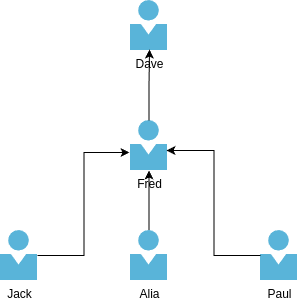
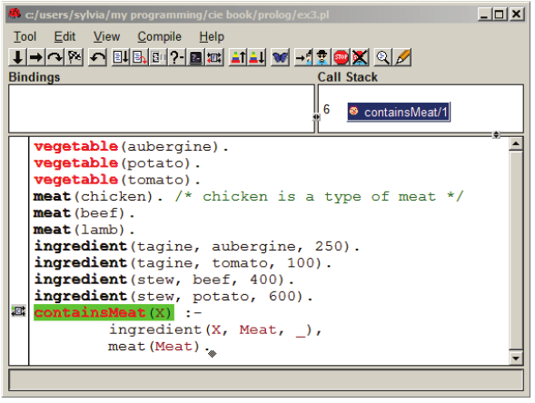

First, [install swi-prolog](./initial_setup) before getting started

## Logic Programming

Programming Languages:
- Imperative Languages
- Declarative Languages

### Introduction

Consider the following example:

- John owns the book.
- Person owns the Object.
- The relationship is "owns."

These relationship problems can be easily solved using logic programming languages like Prolog.

In logic programming, we first establish a knowledge base consisting of facts and rules. This knowledge base represents whatever information we already know about the problem domain.

The machine then takes in this knowledge base along with the question and produces an answer, which can be either "true," "false," or some other output.

Basically

1. We load the knowledge base.
2. User inputs the query.
3. Prolog returns the results.


### Prolog vs. C++/Java

In C++ or Java:

- We use objects, where the problem is divided into different objects that are combined for a particular solution.
- Objects are data structures that can execute methods and inherit from a class hierarchy.

In Prolog:

- Objects are very different, often closely aligned with the English meaning of the problem.
- Prolog terms do not refer to data structures and cannot inherit from anything. They represent things we describe using terms.

### History

Prolog was created in 1970 and has been used in relational databases, design automation, and other fields. It differs from conventional programming languages in that:

- It is a descriptive language, focusing on describing facts and relationships rather than the steps taken by the computer to solve a problem.
- Prolog tells you what to do, not how to do it.

## Prolog

### Keywords

1. **Atom**: Basic data type representing constants or names.
2. **Facts**: Assertions about relationships between entities.
3. **Rule**: Logical statement defining conditions and conclusions.
4. **Predicate**: Named relation or property defined by rules or facts.
5. **Variable**: Placeholder for values, instantiated during execution.
6. **Query**: Goal or question posed to Prolog for solution.

<details>

<summary>Detailed descriptions</summary>

1. **Atom**: In Prolog, an atom is a basic data type representing a constant. Atoms are often used to denote names of predicates, variables, or other constants. They are sequences of characters starting with a lowercase letter or enclosed in single quotes.

2. **Facts**: Facts in Prolog represent assertions about the relationships between various entities in the program's domain. They consist of a predicate followed by a list of arguments, defining a specific relationship or property. Facts are the base units of knowledge in Prolog programs.

3. **Rule**: A rule in Prolog is a logical statement that defines a relationship between certain conditions (antecedents) and a conclusion (consequent). It consists of a head (consequent) and a body (antecedents), separated by the ':-' operator. When the conditions in the body are satisfied, the conclusion in the head can be inferred.

4. **Predicate**: A predicate is a named relation or property defined by a rule or a fact. It consists of a predicate indicator (the predicate name followed by the number of arguments it takes) and may have one or more clauses (facts or rules) associated with it.

5. **Variable**: Variables in Prolog are denoted by strings starting with an uppercase letter or an underscore. They represent placeholders for values that can be instantiated with constants or other variables during program execution. Variables enable Prolog to perform logical inference and provide a mechanism for parameter passing.

6. **Query**: A query in Prolog is a goal or a question posed to the Prolog interpreter about the relationships defined in the program. It consists of a predicate followed by a list of arguments. The Prolog interpreter attempts to find solutions (bindings for variables) that satisfy the query by executing the rules and facts defined in the program.

Generated with ChatGPT
</details>


### Facts

Consider the following example:

- `likes(john, mary).`
    - Read as "John likes Mary."
    - `john` and `mary` are like objects, called **"atoms"**.
    - `likes` is the relationship.
    - Objects are parameters/arguments (what goes inside brackets).
    - End everything with a full stop.

In Prolog, a knowledge base comprises facts, rules, and more, representing universal truths. Prolog utilizes this knowledge base along with questions to provide answers.

When declaring a fact, follow these conventions:

- Start with lowercase. (if it starts with an upper case, it's treated as a Variable)
- Keep it single line.
- Use multiple lines for multiple facts.

Consider this example:

```prolog
valuable(gold).          % This is like a type.
female(jane).            % This is like a type.
owns(jane, gold).        % Jane owns gold.
father(john, mary).      % John is the father of Mary.
gives(john, book, mary). % John gives a book to Mary.
play(john, mary, football).  % John and Mary play football.
play(jane, jim, badminton).  % Jane and Jim play badminton.
```

Notice how the relationships `gives` and `play` are structured differently. Each relationship can have its own structure.

Now, let's load the knowledge base and run some queries:

- Does Mary own gold?
    ```prolog
    ?- owns(mary, gold).
    false.
    ```

- Does Jane own gold?
    ```prolog
    ?- owns(jane, gold).
    true.
    ```

- Does Mary own anything? (We are using an Anonymous Variable here)
    ```prolog
    ?- owns(mary, _).
    false.
    ```

- Does Jane own anything? (We are using an Anonymous Variable here)
    ```prolog
    ?- owns(jane, _).
    true.
    ```

- Proof that the order matters:
    ```prolog
    ?- father(john, mary).
    true.

    ?- father(mary, john).
    false.
    ```

- "human" is not in the knowledge base (it's undefined):
    ```prolog
    ?- human(john).
    ERROR: Unknown procedure: human/1 (DWIM could not correct goal).
    ```


### Variables

- Variables start with an uppercase letter.
- Press `;` button on the keyboard to find additional results until everything is listed, once everything is listed, the final result will end with a `.` (period) and you will be taken back to the prompt. (`;` basically means OR)
- The last item in the list of results ends with a full stop.
- Note that `_` is the anonymous variable. Scroll up to the "Does Mary own anything?" example to understand it further.

Consider the following database / knowledge base of likes and dislikes:

```prolog
likes(jim, flowers).
likes(jim, peanuts).
likes(jim, mangoes).
likes(jim, oranges).
likes(john, oranges).
likes(jane, oranges).
dislikes(jim, apple).
```

- **Query:** What does John like?
    ```prolog
    ?- likes(jim, Item).
    Item = flowers ;
    Item = peanuts ;
    Item = mangoes ;
    Item = oranges.   % The last item in the list ends with a full stop.
    ```

- **Query:** Who likes oranges?
    ```prolog
    ?- likes(Person, oranges).
    Person = jim ;
    Person = john ;
    Person = jane.
    ```

- **Query:** Who likes what?
    ```prolog
    ?- likes(Person, Item).       % both are variables
    Person = jim, Item = flowers ;
    Person = jim, Item = peanuts ;
    Person = jim, Item = mangoes ;
    Person = jim, Item = oranges ;
    Person = john, Item = oranges ;
    Person = jane, Item = oranges.
    ```

### AND / OR / NOT

In Prolog:

- **AND** is represented by `,`.
- **OR** is represented by `;`.
- **NOT** is represented by `not`.

Consider the updated database of likes and dislikes:

```prolog
likes(jim, flowers).
likes(john, flowers). % Added this new line.
likes(jim, peanuts).
likes(jim, mangoes).
likes(jim, oranges).
likes(john, oranges).
likes(jane, oranges).
dislikes(jim, apple).
```

- **Query:** Listing all likes:
    ```prolog
    ?- listing(likes).
    likes(jim, flowers).
    likes(john, flowers).
    likes(jim, peanuts).
    likes(jim, mangoes).
    likes(jim, oranges).
    likes(john, oranges).
    likes(jane, oranges).
    true.
    ```

- **Query:** Does Jim like flowers OR does John like apples?
    ```prolog
    ?- likes(jim, flowers); likes(john, apples).
    true.
    ```
    Explanation: `likes(jim, flowers)` is true, and `likes(john, apples)` is false.

- **Query:** Does Jim like flowers AND does John like apples?
    ```prolog
    ?- likes(jim, flowers), likes(john, apples).
    false.
    ```
    Explanation: `likes(jim, flowers)` is true, but `likes(john, apples)` is false, so the conjunction is false.

- **Query:** Things both Jim and John like in common:
    ```prolog
    ?- likes(jim,X).
    X = flowers ;
    X = peanuts ;
    X = mangoes ;
    X = oranges.

    ?- likes(john,X).
    X = flowers ;
    X = oranges.
    
    ?- likes(jim, X), likes(john, X).
    X = flowers ;
    X = oranges.
    ```
    Explanation: Both Jim and John like flowers and oranges.

- **Query:** Using the anonymous variable:
    ```prolog
    ?- likes(john, _).
    true ;
    true.
    ```
    Explanation: John likes only two items.


### Basic Rules

Rules are logical statements defining conditions and conclusions.

In Prolog, `:-` means "if".


```prolog
% Fact: Romeo loves Juliet.
loves(romeo, juliet).

% Rule: Juliet loves Romeo if Romeo loves Juliet.
loves(juliet, romeo) :- loves(romeo, juliet).
```

Additional rules and facts:

```prolog
% Facts: Albert and Alice are happy.
happy(albert).
happy(alice).

% Fact: Alice is with Albert.
with_albert(alice).

% Rule: Albert laughs if he is happy.
laughs(albert) :-
    happy(albert).

% Rule: Alice dances if she is happy and with Albert.
dances(alice) :-
    happy(alice), % "and"
    with_albert(alice).

% Rule: Alice does dance if she dances.
does_alice_dance :- 
    dances(alice),
    write('When Alice is happy with Albert, she dances'). % like print() in python
```

- **Query:** Does albert laugh?
    ```prolog
    ?- laughs(albert).
    true.
    ```
- **Query:** Does albert dance?
    ```prolog
    ?- dances(albert).
    false.
    ```
    Explanation: This is false because `dances` is written explicitly for alice only. If we want it to work with anything, we can use variables. More on that later.


- **Query:** Does alice dance?
    ```prolog
    ?- dances(alice).
    true.
    ```

- **Query:** Does alice dance?
    ```prolog
    ?- does_alice_dance.
    When Alice is happy with Albert, she dances
    true.
    ```

### Advanced Rules

Consider this family tree example:



It can be written as follows in the database:

```prolog
% Facts to define the family tree
parent(fred, jack). % fred is the parent of jack
parent(fred, alia).
parent(fred, paul).
parent(dave, fred).
```

We know that G is a grandparent of S, if G is a parent of P and P is a parent of S. We could write this as a rule: (Note that we introduced a temporary variable P which is being used within the rule)

```prolog
% grandparent(G, S) IF parent(G, P) AND parent(P, S).
grandparent(G, S) :- parent(G, P), parent(P, S).
```

A person has a sibling (brother or sister) if they have the same parent. We can write this as the Prolog rule:

```
sibling(A, B) :-
    parent(P, A),   % and
    parent(P, B).
```

- **Query:** Jack is the grandparent of whom?
    ```prolog
    ?- grandparent(jack, X).
    false.
    ```
    Explanation: Jack is not a grandparent as he is in the youngest generation of the family tree.

- **Query:** Who is the grandparent of jack?
    ```prolog
    ?- grandparent(X, jack).
    X = dave.
    ```

- **Query:** Dave is the grandparent of whom?
    ```prolog
    ?- grandparent(dave, X).
    X = jack ;
    X = alia ;
    X = paul.
    ```

- **Query:** Who are the siblings of Jack?
    ```prolog
    ?- sibling(X, fred).
    X = fred.
    ```
    Note: We get that fred is his own sibling

- **Query:** Who are the siblings of Paul?
    ```prolog
    ?- sibling(X, paul).
    X = jack ;
    X = alia ;
    X = paul.
    ```
    Note: We get the answers we expect, but we also get the answer that Paul is his own sibling.

Note: in the last 2 examples, the part of our query is also returned in the answer/result. To fix it, we can modify the code as follows:

```prolog
sibling(A, B) :-
    parent(P, A),
    parent(P, B),
    not(A=B).       % will stop giving the question itself as an answer
```

Running the last two quries once again:

- **Query:** Who are the siblings of Jack?
    ```prolog
    ?- sibling(X, fred).
    false.
    ```

- **Query:** Who are the siblings of Paul?
    ```prolog
    ?- sibling(X, paul).
    X = jack ;
    X = alia.
    ```

### Instantiation and backtracking

Watch this video to learn more:

<iframe width="560" height="315" src="https://www.youtube.com/embed/AmWf6SeFmqc?si=ytVWrmpIu38DbCrq" title="YouTube video player" frameborder="0" allow="accelerometer; autoplay; clipboard-write; encrypted-media; gyroscope; picture-in-picture; web-share" allowfullscreen></iframe>

In Prolog, when a query is made, Prolog responds with an answer, typically represented as X = Value. However, it's important to note that the = sign in Prolog does not signify assignment as in imperative programming languages; rather, it indicates instantiation. 

Basically, 

Prolog uses the knowledge base to arrive at answers through a process that can be observed using the graphical debugger or by typing trace. in the Prolog environment. By stepping through the program using the space bar, one can observe Prolog's execution flow.

During this process, several key terms are used to describe Prolog's behavior:

- **Call:** Represents the initial entry into a predicate.
- **Creep:** Indicates Prolog's movement to the next predicate during execution.
- **Exit:** Signifies a successful return from a predicate.
- **Redo:** Indicates that Prolog is attempting to backtrack into a predicate to find another answer.
- **Fail:** Indicates that Prolog has exhausted all possible solutions and cannot find any more.

Using the graphical debugger or tracing in the Prolog environment provides insight into how Prolog utilizes the knowledge base to arrive at solutions and how it navigates through the search space using backtracking to explore alternative paths.

First, run `trace.` 

```prolog
?- trace.
true.
```

Then, run your query. In Windows, a seperate graphical debugger window will be opened, but not in Linux.

```
[trace]  ?- sibling(X, paul).
   Call: (10) sibling(_4360, paul) ? creep
   Call: (11) parent(_5550, _4360) ? creep
   Exit: (11) parent(fred, jack) ? creep
   Call: (11) parent(fred, paul) ? creep
   Exit: (11) parent(fred, paul) ? creep
^  Call: (11) not(jack=paul) ? creep
^  Exit: (11) not(user:(jack=paul)) ? creep
   Exit: (10) sibling(jack, paul) ? creep
X = jack .
```

Graphical Debugger Window in Microsoft Windows:



<details>
<summary>Another example:</summary>

Consider the following knowledge base:

```prolog
likes(john, apples).
likes(john, bananas).
likes(mary, bananas).
likes(mary, oranges).
```

Let's run some queries and observe Prolog's behavior:

1. **Query:** Who likes apples?

    ```prolog
    ?- likes(Person, apples).
    Person = john ;
    false.
    ```

    Explanation:
    - Prolog responds with `Person = john`, indicating that John likes apples.
    - Pressing `;` allows Prolog to backtrack and explore alternative solutions. However, in this case, there are no more solutions, so Prolog responds with `false`.

2. **Query:** Does John like any fruit?

    ```prolog
    ?- likes(john, Fruit).
    Fruit = apples ;
    Fruit = bananas ;
    false.
    ```

    Explanation:
    - Prolog responds with `Fruit = apples` and `Fruit = bananas`, indicating that John likes apples and bananas.
    - Pressing `;` allows Prolog to backtrack and explore alternative solutions. However, in this case, there are no more solutions, so Prolog responds with `false`.

3. **Query:** Who likes bananas and oranges?

    ```prolog
    ?- likes(Person, bananas), likes(Person, oranges).
    Person = mary ;
    false.
    ```

    Explanation:
    - Prolog responds with `Person = mary`, indicating that Mary likes both bananas and oranges.
    - Pressing `;` allows Prolog to backtrack and explore alternative solutions. However, in this case, there are no more solutions, so Prolog responds with `false`.

</details>


### Recursive Rules

In imperative languages, recursion involves defining a function that calls itself. 

However, in Prolog, recursion involves defining rules where a rule can use itself as a sub-goal.

We aim to define a rule to determine if person A is an ancestor of person B. 
- This rule states that if A is a parent of B, then A is an ancestor of B. 
- Furthermore, if person A is the parent of someone (P) who is a parent of B, then A is also an ancestor of B. 
- This concept extends recursively to include ancestors of ancestors. 

```prolog
% Base case
ancestor(A, B) :- parent(A, B). 

% General case
ancestor(A, B) :- parent(A, X), ancestor(X, B). 
```

It's crucial to note that recursive rules in declarative programming, including Prolog, must adhere to certain principles similar to those in imperative programming:

- Have a base case.
- Have a general case.
- **Reach the base case after a finite number of calls to itself.** 
    - *(like the max. recursion depth in python)*

- **Query:** Who are the ancestors of jack? (youngest generation)
    ```
    ?- ancestor(X,jack).
    X = fred ;
    X = dave ;
    false.
    ```

- **Query:** Who are the ancestors of fred? (middle generation)
    ```
    ?- ancestor(X,fred).
    X = dave ;
    false.
    ```

- **Query:** Who are the ancestors of dave? (eldest generation)
    ```
    ?- ancestor(X,dave).
    false.
    ```

- **Query:** Who is younger than dave? (eldest generation)
    ```
    ?- ancestor(dave,X).
    X = fred ;
    X = jack ;
    X = alia ;
    X = paul ;
    false.
    ```

#### Factorial

I'm not very confident about this part

Below code which goes to the knowledge base is an implementation of the factorial function using recursive rules/goals in prolog.

```porlog
factorial(0, 1).
factorial(N, Result) :-
    M is N - 1,
    factorial(M, PartResult),
    Result is PartResult * N.
```

- **Query:** 
```prolog
?- factorial(5,X).
X = 120 ;
;;ERROR: Stack limit (1.0Gb) exceeded
ERROR:   Stack sizes: local: 0.9Gb, global: 77.8Mb, trail: 0Kb
ERROR:   Stack depth: 10,190,797, last-call: 0%, Choice points: 3
ERROR:   Possible non-terminating recursion:
ERROR:     [10,190,797] user:factorial(-10190782, _20385830)
ERROR:     [10,190,796] user:factorial(-10190781, _20385850)
```

- **Query:** 
```prolog
?- factorial(120,X).
X = 6689502913449127057588118054090372586752746333138029810295671352301633557244962989366874165271984981308157637893214090552534408589408121859898481114389650005964960521256960000000000000000000000000000 ;
ERROR: Stack limit (1.0Gb) exceeded
ERROR:   Stack sizes: local: 0.9Gb, global: 77.8Mb, trail: 0Kb
ERROR:   Stack depth: 10,190,327, last-call: 0%, Choice points: 3
ERROR:   In:
ERROR:     [10,190,327] user:factorial(-10190197, _20390728)
ERROR:     [10,190,326] user:factorial(-10190196, _20390748)
ERROR:     [10,190,325] user:factorial(-10190195, _20390768)
ERROR:     [10,190,324] user:factorial(-10190194, _20390788)
ERROR:     [10,190,323] user:factorial(-10190193, _20390808)
ERROR: 
ERROR: Use the --stack_limit=size[KMG] command line option or
ERROR: ?- set_prolog_flag(stack_limit, 2_147_483_648). to double the limit.
```


- **Query:** 
```prolog
?- factorial(5,X).
X = 120 ;
ERROR: Stack limit (1.0Gb) exceeded
ERROR:   Stack sizes: local: 0.9Gb, global: 77.8Mb, trail: 0Kb
ERROR:   Stack depth: 10,190,925, last-call: 0%, Choice points: 3
ERROR:   Possible non-terminating recursion:
ERROR:     [10,190,925] user:factorial(-10190910, _20384088)
ERROR:     [10,190,924] user:factorial(-10190909, _20384108)
```

- **Query:** 
```prolog
?- factorial(X,5).
ERROR: Arguments are not sufficiently instantiated
ERROR: In:
ERROR:   [10] factorial(_1382,5)
ERROR:    [9] toplevel_call(user:user: ...) at /usr/lib/swi-prolog/boot/toplevel.pl:1158
```

- **Query:** 
```prolog
?- factorial(X,120).
ERROR: Arguments are not sufficiently instantiated
ERROR: In:
ERROR:   [10] factorial(_4868,120)
ERROR:    [9] toplevel_call(user:user: ...) at /usr/lib/swi-prolog/boot/toplevel.pl:1158
```
