## Download

:::warning

Please make sure that you download a non-evaluvation copy. Windows 2021 LTSC Evaluation can’t be activated, after 90 days trial you need to reinstall. If you want to use LTSC version, download full edition LTSC ISO from Visual Studio subscription or VLSC, then activate it by volume license, or "sail the seven seas with captain haddock" it at [MyDigitalLife Forum](https://forums.mydigitallife.net/)

:::

- Non evaluvation copy can be found at: (this is what we want)
  - [MyDigitalLife Forum](https://forums.mydigitallife.net/) - Log in and download it

- Evaluvation copies can be found at:
  - [massgrave.dev](https://massgrave.dev/genuine-installation-media.html)
  - [os.click](https://os.click/en)
  - [rg-adguard.net](https://files.rg-adguard.net/version/f0bd8307-d897-ef77-dbd6-216fefbe94c5)

## Install

:::note

Made with the help of this article by linuxhint.com written by Ali Usman: https://linuxhint.com/download-and-install-windows-10-ltsc/. Images were taken from this article.

:::

### Create a Bootable USB Drive

- ["Rufus"](https://rufus.ie/en/) and ["balenaEtcher"](https://etcher.balena.io/) are incredibly powerful applications that enable users to create bootable USB drives to install the operating systems. Here, we will use the “balenaEtcher”; if you want to use the “Rufus”, [follow this guide](https://linuxhint.com/install-windows-from-a-bootable-usb/). To create a bootable USB drive, follow the below-given instructions:

- Launch BalenaEtcher

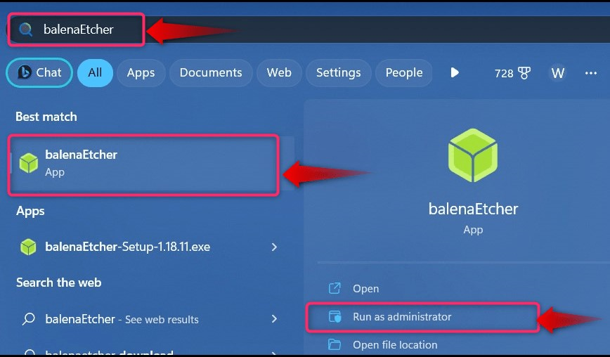

- Create Windows 10 LTSC Bootable USB Drive

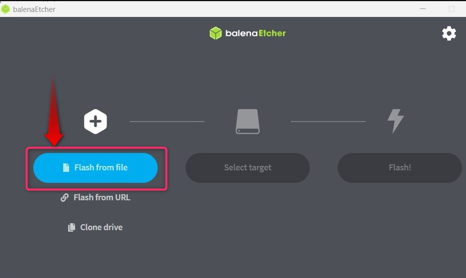

- Next, use the “Select target” to choose the USB drive you want to use as the installation media:

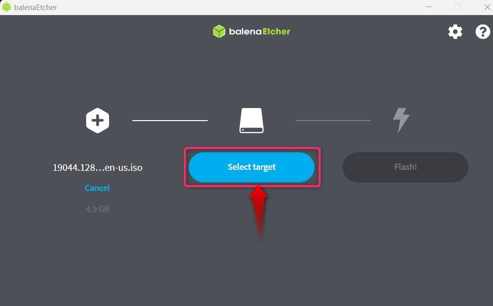

- After selecting the drive, verify and hit the “Select” button to continue with the process:

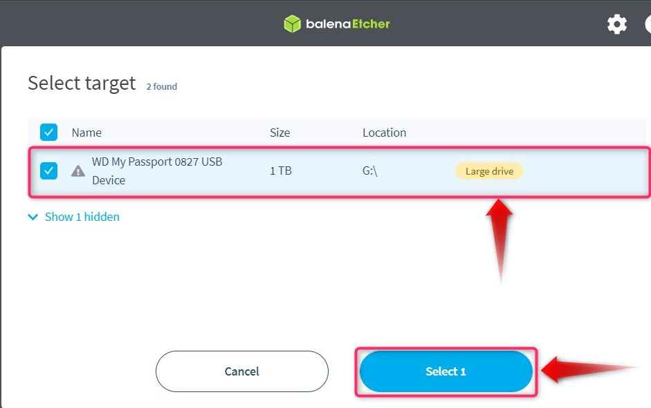

- Finally, use the “Flash” button to start the process of making the bootable USB drive:

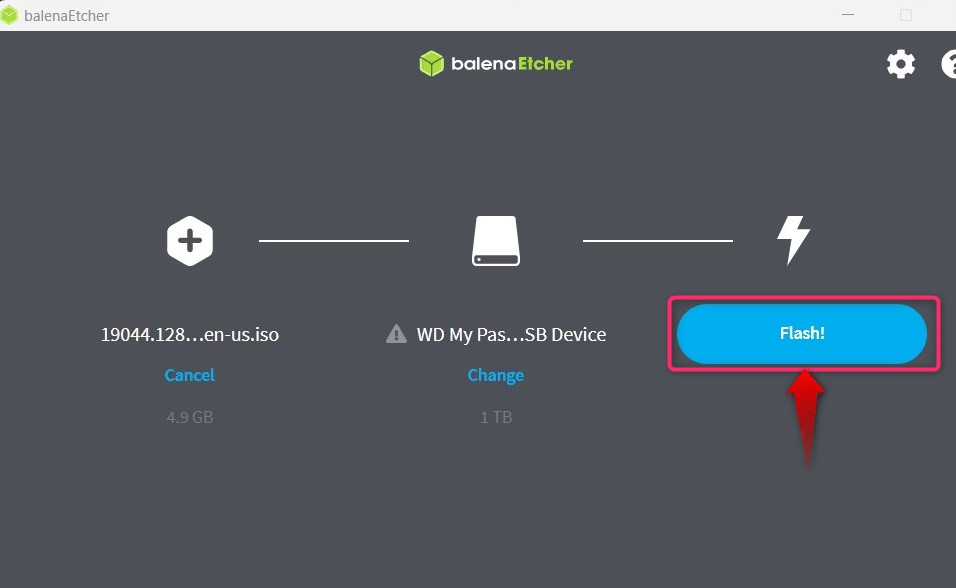

### Boot from USB

- Boot From Windows 10 LTSC USB Drive

- Once you are done with “Step 2”, reboot the system and trigger its boot using the “Esc, F2, F10, or F12” keys and select “Boot from USB” and it will take you to the installation process.

### Install

- To begin with the “Windows 10 LTSC”, you shall be asked to choose the language, and once done, hit the “Next” button to continue with the process:

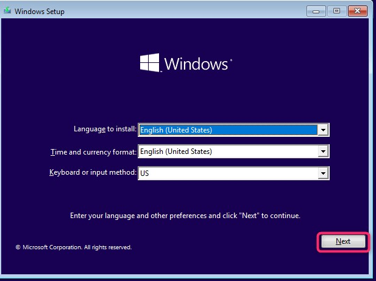

- Next, use the “Install now” button to begin the installation process:

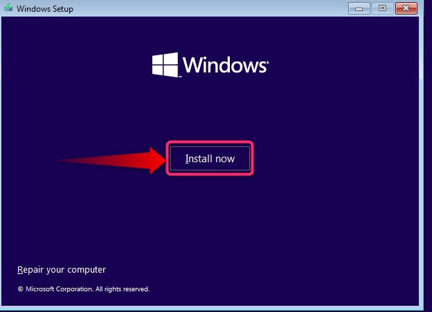

- From the following screen, you must select the “Operating System Version”:

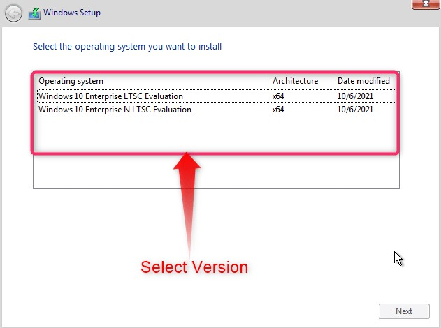

- Followed by that, accept the license terms by checking the highlighted checkbox and hitting the “Next” button:

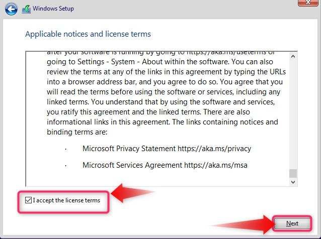

- After that, choose the installation type whether you want to keep the files “Upgrade” or perform a fresh OS install “Custom”:

- Now select the disk on which you want to install the “Windows 10 LTSC” and use the “Next” button to continue:

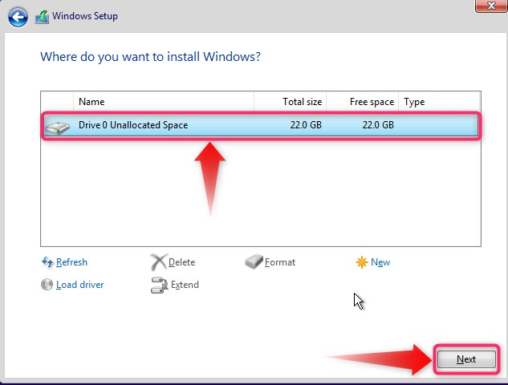

- It will now begin the installation which would take a few minutes before completion:

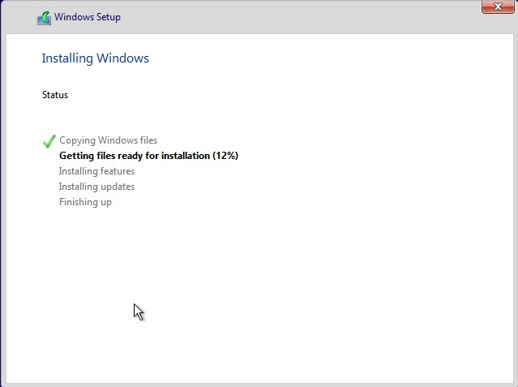

After the installation is complete, update your system.
