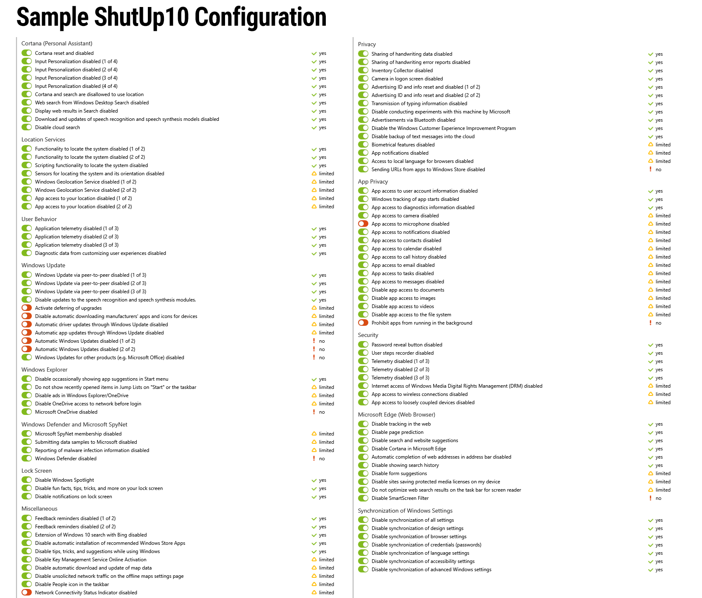
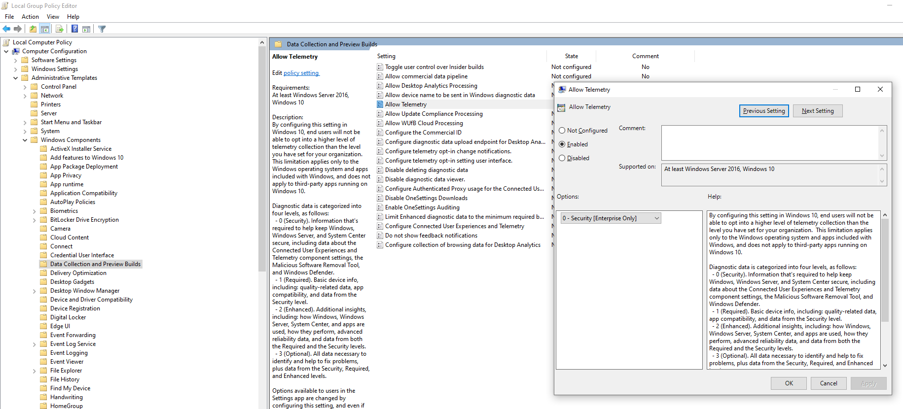
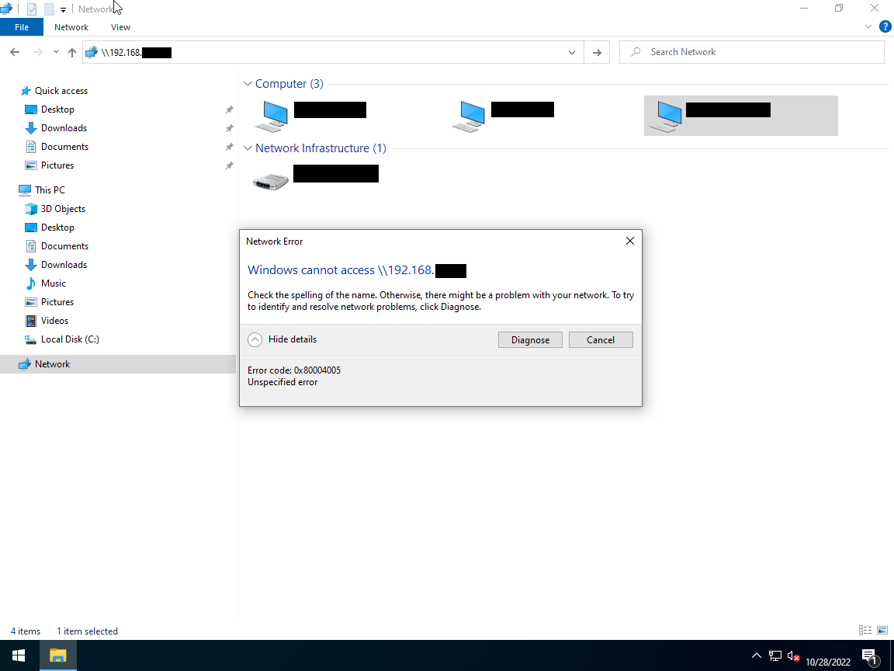
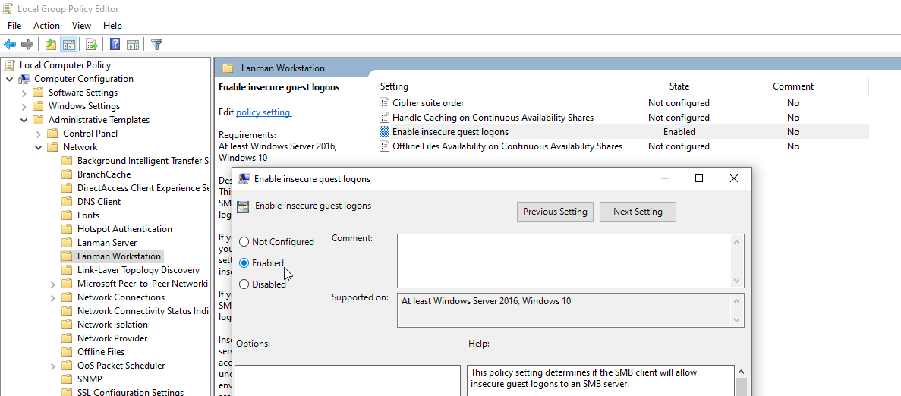
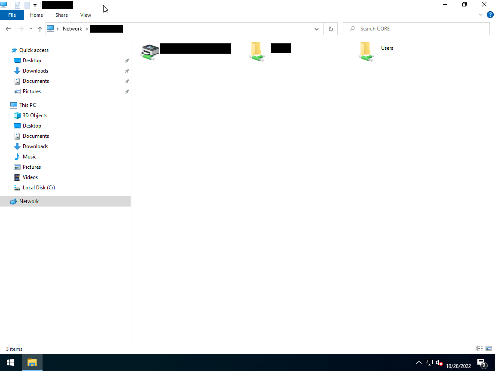
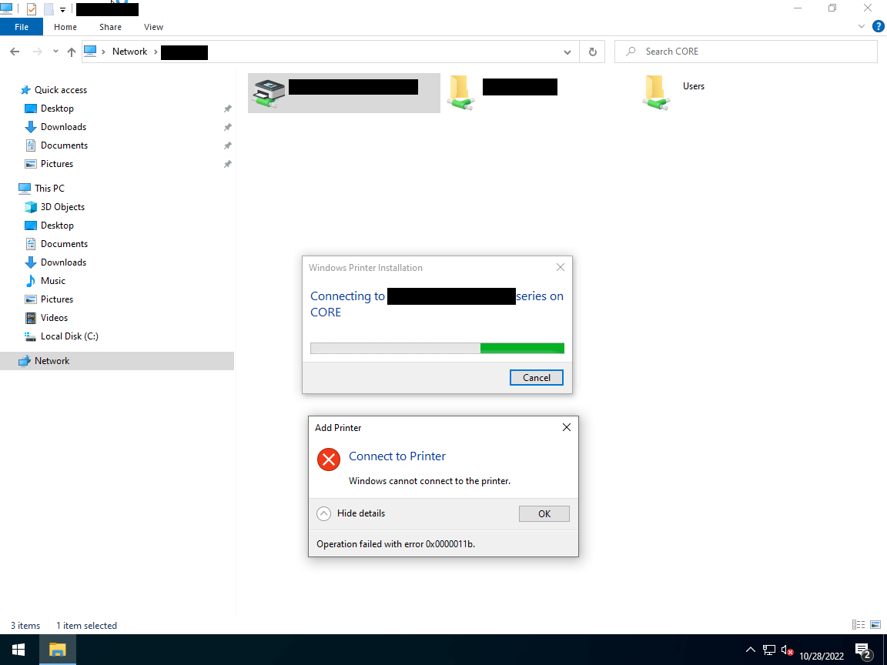
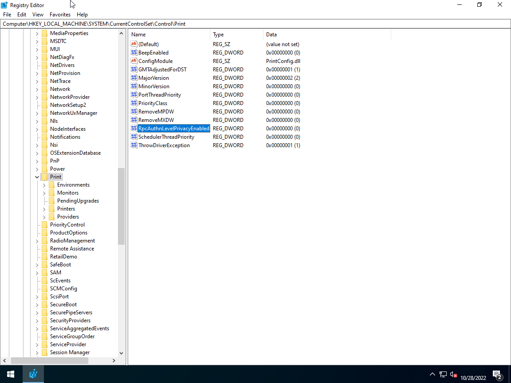
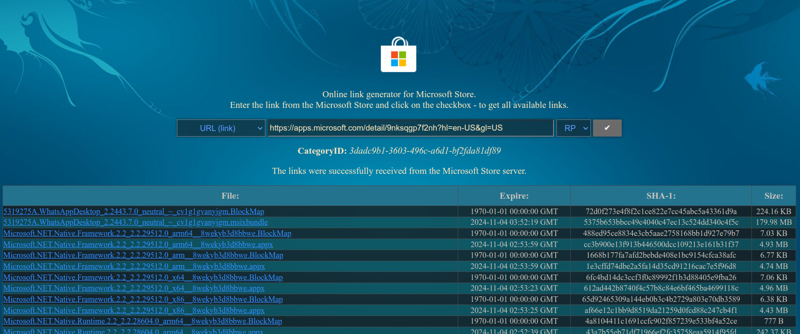
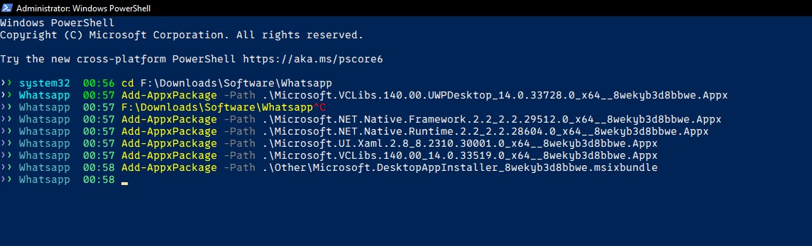
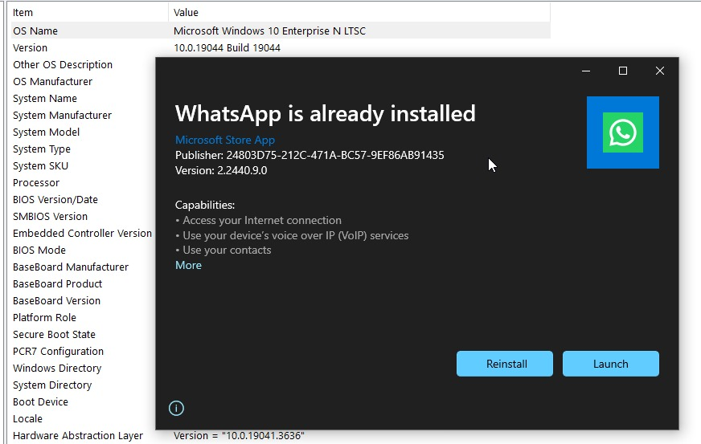

- do this to make windows ltsc 2021 daily drivable.
- Make sure to check this out: [Guide to install and optimize Windows 10 LTSC](https://rentry.co/LTSC)
- You might also wan't to take a look at this great project: [LiveScript-LTSC-21H2 by Marctraider](https://github.com/Marctraider/LiveScript-LTSC-21H2)

## Disable Telemtry

### Using O&O ShutUp10

- Luckily, no bloatware comes pre-installed with this version of windows, but, there's still some telemetry left.

- Download and run [O&O ShutUp10](https://www.oo-software.com/en/shutup10) to disable telemetry.



### Disabling `Allow Telemetry`

- to disable Allow Telemetry

   1. Open the Local Group Policy Editor (`gpedit.msc` in Run)
   2. Go to "Administrative Templates" -> "Windows Components" -> "Data Collection and Peview Builds" -> "Allow Telemetry"
   3. Disable it



## Access Public Network Shares

### Folders/Data (`0x80004005`)

- If you are the kind of person that has your small local samba share setup at your house with no authentication (guest login allowed), you will run into this error: `0x80004005`



- Microsoft posts the official "workaround" which is enabling the "AllowInsecureGuestAuth" group policy

   1. Open the Local Group Policy Editor (`gpedit.msc` in Run)
   2. Go to "Administrative Templates" -> "Networks" -> "Lanman Workstation" -> "Enable insecure guest logons"
   3. Enable it



- And it works



### Printers (`0x0000011b`)

- But, when you try to access a printer, you will get this error: `0x0000011b`



- The posted official workaround is incomplete and printing doesn't fully respect this group policy configuration because as a fix for [CVE-2021-1678](https://msrc.microsoft.com/update-guide/vulnerability/CVE-2021-1678) Microsoft increased the printer spooler protection but they forgot to let printing work for people who don't bother too much with proper encryption and authentication which `AllowInsecureGuestAuth` disables

- To fix it, add or modify a Printer Spooler registry setting called `RpcAuthnLevelPrivacyEnabled`

```
[HKEY_LOCAL_MACHINE\System\CurrentControlSet\Control\Print]
"RpcAuthnLevelPrivacyEnabled"=dword:00000000
```

- or, run this powershell command:

```
Set-ItemProperty -Path 'HKLM:\System\CurrentControlSet\Control\Print' -Name 'RpcAuthnLevelPrivacyEnabled' -Value 0
```

- Restarting the Printer Spooler service is enough to apply the fix



- Looking back at both of these error, if they still won't work, try this instead:

1. Set `HKEY_LOCAL_MACHINE\SYSTEM\CurrentControlSet\Services\LanmanWorkstation\Parameters\AllowInsecureGuestAuth` to 1

   - You can also run the command below:

   ```
   Set-ItemProperty -Path 'HKLM:\SYSTEM\CurrentControlSet\Services\LanmanWorkstation\Parameters' -Name 'AllowInsecureGuestAuth' -Value 1
   ```

2. You may also have to enable/run 2 system services at `services.msc`:
   - Function Discovery Provider Host
   - Function Discovery Resource Publication
   - both of which got disabled by default, and is for network sharing/browsing.

## Restore Photo Viewer

### Restore

:::info

The below guide is to enable Windows Photo Viewer for the current User. To enable it for the whole system, follow [this guide by tenforums.com](https://www.tenforums.com/tutorials/14312-restore-windows-photo-viewer-windows-10-a.html)

:::

<iframe width="560" height="315" src="https://www.youtube.com/embed/aQhLGU_xlQw?si=hXK1k4DUKFYXhTdQ" title="YouTube video player" frameborder="0" allow="accelerometer; autoplay; clipboard-write; encrypted-media; gyroscope; picture-in-picture; web-share" allowfullscreen></iframe>

- Save the contents below to file `.reg` file

```reg
Windows Registry Editor Version 5.00

; Restore_Windows_Photo_Viewer_CURRENT_USER.reg
; Created by: Shawn Brink
; Created on: June 27th 2016
; Updated on: May 7th 2019
; Tutorial: https://www.tenforums.com/tutorials/14312-restore-windows-photo-viewer-windows-10-a.html


[HKEY_CURRENT_USER\SOFTWARE\Classes\.bmp]
@="PhotoViewer.FileAssoc.Tiff"

[HKEY_CURRENT_USER\SOFTWARE\Classes\.cr2]
@="PhotoViewer.FileAssoc.Tiff"

[HKEY_CURRENT_USER\SOFTWARE\Classes\.dib]
@="PhotoViewer.FileAssoc.Tiff"

[HKEY_CURRENT_USER\SOFTWARE\Classes\.gif]
@="PhotoViewer.FileAssoc.Tiff"

[HKEY_CURRENT_USER\SOFTWARE\Classes\.ico]
@="PhotoViewer.FileAssoc.Tiff"

[HKEY_CURRENT_USER\SOFTWARE\Classes\.jfif]
@="PhotoViewer.FileAssoc.Tiff"

[HKEY_CURRENT_USER\SOFTWARE\Classes\.jpe]
@="PhotoViewer.FileAssoc.Tiff"

[HKEY_CURRENT_USER\SOFTWARE\Classes\.jpeg]
@="PhotoViewer.FileAssoc.Tiff"

[HKEY_CURRENT_USER\SOFTWARE\Classes\.jpg]
@="PhotoViewer.FileAssoc.Tiff"

[HKEY_CURRENT_USER\SOFTWARE\Classes\.jxr]
@="PhotoViewer.FileAssoc.Tiff"

[HKEY_CURRENT_USER\SOFTWARE\Classes\.png]
@="PhotoViewer.FileAssoc.Tiff"

[HKEY_CURRENT_USER\SOFTWARE\Classes\.tif]
@="PhotoViewer.FileAssoc.Tiff"

[HKEY_CURRENT_USER\SOFTWARE\Classes\.tiff]
@="PhotoViewer.FileAssoc.Tiff"

[HKEY_CURRENT_USER\SOFTWARE\Classes\.wdp]
@="PhotoViewer.FileAssoc.Tiff"


[HKEY_CURRENT_USER\SOFTWARE\Microsoft\Windows\CurrentVersion\Explorer\FileExts\.bmp\OpenWithProgids]
"PhotoViewer.FileAssoc.Tiff"=hex(0):

[HKEY_CURRENT_USER\SOFTWARE\Microsoft\Windows\CurrentVersion\Explorer\FileExts\.cr2\OpenWithProgids]
"PhotoViewer.FileAssoc.Tiff"=hex(0):

[HKEY_CURRENT_USER\SOFTWARE\Microsoft\Windows\CurrentVersion\Explorer\FileExts\.dib\OpenWithProgids]
"PhotoViewer.FileAssoc.Tiff"=hex(0):

[HKEY_CURRENT_USER\SOFTWARE\Microsoft\Windows\CurrentVersion\Explorer\FileExts\.gif\OpenWithProgids]
"PhotoViewer.FileAssoc.Tiff"=hex(0):

[HKEY_CURRENT_USER\SOFTWARE\Microsoft\Windows\CurrentVersion\Explorer\FileExts\.ico\OpenWithProgids]
"PhotoViewer.FileAssoc.Tiff"=hex(0):

[HKEY_CURRENT_USER\SOFTWARE\Microsoft\Windows\CurrentVersion\Explorer\FileExts\.jpeg\OpenWithProgids]
"PhotoViewer.FileAssoc.Tiff"=hex(0):

[HKEY_CURRENT_USER\SOFTWARE\Microsoft\Windows\CurrentVersion\Explorer\FileExts\.bmp\OpenWithProgids]
"PhotoViewer.FileAssoc.Tiff"=hex(0):

[HKEY_CURRENT_USER\SOFTWARE\Microsoft\Windows\CurrentVersion\Explorer\FileExts\.jfif\OpenWithProgids]
"PhotoViewer.FileAssoc.Tiff"=hex(0):

[HKEY_CURRENT_USER\SOFTWARE\Microsoft\Windows\CurrentVersion\Explorer\FileExts\.jpe\OpenWithProgids]
"PhotoViewer.FileAssoc.Tiff"=hex(0):

[HKEY_CURRENT_USER\SOFTWARE\Microsoft\Windows\CurrentVersion\Explorer\FileExts\.jxr\OpenWithProgids]
"PhotoViewer.FileAssoc.Tiff"=hex(0):

[HKEY_CURRENT_USER\SOFTWARE\Microsoft\Windows\CurrentVersion\Explorer\FileExts\.jpeg\OpenWithProgids]
"PhotoViewer.FileAssoc.Tiff"=hex(0):

[HKEY_CURRENT_USER\SOFTWARE\Microsoft\Windows\CurrentVersion\Explorer\FileExts\.jpg\OpenWithProgids]
"PhotoViewer.FileAssoc.Tiff"=hex(0):

[HKEY_CURRENT_USER\SOFTWARE\Microsoft\Windows\CurrentVersion\Explorer\FileExts\.png\OpenWithProgids]
"PhotoViewer.FileAssoc.Tiff"=hex(0):

[HKEY_CURRENT_USER\SOFTWARE\Microsoft\Windows\CurrentVersion\Explorer\FileExts\.tif\OpenWithProgids]
"PhotoViewer.FileAssoc.Tiff"=hex(0):

[HKEY_CURRENT_USER\SOFTWARE\Microsoft\Windows\CurrentVersion\Explorer\FileExts\.tiff\OpenWithProgids]
"PhotoViewer.FileAssoc.Tiff"=hex(0):

[HKEY_CURRENT_USER\SOFTWARE\Microsoft\Windows\CurrentVersion\Explorer\FileExts\.wdp\OpenWithProgids]
"PhotoViewer.FileAssoc.Tiff"=hex(0):
```

- then, Right click -> Merge

- Go to the Default Apps section in Settings and select Micrososft Photo Viewer

### Alternative

The only good alternative to Microsoft Photos is [Honeyview](https://www.bandisoft.com/honeyview/)

To install [HoneyView with chocolatey](https://community.chocolatey.org/packages/honeyview.install), run:

```
choco install honeyview.install
```

## OneDrive Problem

:::note

Source: https://rentry.org/od_problem

:::

### Problem

- The personal Onedrive icon inside navigation panel does not work. The property page shows blank. By using `Win+R` to run `shell:::{018D5C66-4533-4307-9B53-224DE2ED1FE6}`, you should see the OneDrive folder opened but it’s not.
- However, the business account will work completely fine and also other file sync application such as iCloud and nextCloud.
- This happens to all latest OneDrive version (32/64 bit) installed per users or for all users under Windows 10 LTSC 2021.
- by the way, the default version bundled with Windows 10 is 32 bit regardless of the Windows version.

### Reason

- When you setup the personal OneDrive account, the client should register the icon in navigation panel pointing to a CLSID (Basically the GUID of the folder registered as Known Folders) `{A52BBA46-E9E1-435f-B3D9-28DAA648C0F6}`.
- This is the CLSID of the OneDrive folder which should be registered meanwhile, and it contains the path to the OneDrive folder.
- BUT the client did not do so in LTSC
- Therefore, when you start the explorer, the icon itself was displayed, but it points to a ID which doesn’t exist.

### Solution

- Copy the following content into a text file, save it as `ANYNAME.reg`, double click on it and let the regedit import it. Restart the file explorer and all set!
- This only applies if your OneDrive folder is at the default location. e.g. `C:\User\username\OneDrive`.
- If it’s not but still under your user folder e.g. `C:\User\username\ExampleFolder`, you need to change the value of `RelativePath` to `ExampleFolder`.
- If it’s not under your user folder, e.g. `E:\OneDrive`, you need to remove the line `"ParentFolder"="{5E6C858F-0E22-4760-9AFE-EA3317B67173}"`, and change the value of RelativePath to the absolute path such as `"RelativePath"="E:\OneDrive"`.

```
Windows Registry Editor Version 5.00

[HKEY_LOCAL_MACHINE\SOFTWARE\Microsoft\Windows\CurrentVersion\Explorer\FolderDescriptions\{5E6C858F-0E22-4760-9AFE-EA3317B67173}]
"Category"=dword:00000002
"Name"="Profile"

[HKEY_LOCAL_MACHINE\SOFTWARE\Microsoft\Windows\CurrentVersion\Explorer\FolderDescriptions\{A52BBA46-E9E1-435f-B3D9-28DAA648C0F6}]
"Attributes"=dword:00000001
"Category"=dword:00000004
"DefinitionFlags"=dword:00000040
"Icon"=hex(2):25,00,53,00,79,00,73,00,74,00,65,00,6d,00,52,00,6f,00,6f,00,74,  00,25,00,5c,00,73,00,79,00,73,00,74,00,65,00,6d,00,33,00,32,00,5c,00,69,00,  6d,00,61,00,67,00,65,00,72,00,65,00,73,00,2e,00,64,00,6c,00,6c,00,2c,00,2d,  00,31,00,30,00,34,00,30,00,00,00
"LocalizedName"=hex(2):40,00,25,00,53,00,79,00,73,00,74,00,65,00,6d,00,52,00,  6f,00,6f,00,74,00,25,00,5c,00,53,00,79,00,73,00,74,00,65,00,6d,00,33,00,32,  00,5c,00,53,00,65,00,74,00,74,00,69,00,6e,00,67,00,53,00,79,00,6e,00,63,00,  43,00,6f,00,72,00,65,00,2e,00,64,00,6c,00,6c,00,2c,00,2d,00,31,00,30,00,32,  00,34,00,00,00
"LocalRedirectOnly"=dword:00000001
"Name"="OneDrive"
"ParentFolder"="{5E6C858F-0E22-4760-9AFE-EA3317B67173}"
"ParsingName"="shell:::{018D5C66-4533-4307-9B53-224DE2ED1FE6}"
"RelativePath"="OneDrive"
```

## Install Chocolately

[Click here](../chocolately) for more information.

## Install WhatsApp Desktop

Installing WhatsApp on Windows LTSC 2021 requires a few extra steps since the Microsoft Store isn’t natively available. Here’s a simple guide to get it set up:

### Approach 1

:::warning Warning

This doesn't always work!

:::

Visit [RedrootDEV/WhatsAppDesktop-NoStore](https://github.com/RedrootDEV/WhatsAppDesktop-NoStore/tree/main) repository and download the latest release. Extract it and run the executable as an Administrator. It will download the `msixbundle` and install it for you. It will also update it, if already installed.

### Approach 2

**Step 1: Get the WhatsApp Desktop URL**

1. Go to the Microsoft Store’s [WhatsApp Desktop page](https://apps.microsoft.com/detail/9nksqgp7f2nh?hl=en-US&gl=US).
2. Copy the URL of the page.

**Step 2: Generate Download Links for Required Files**

1. Visit [store.rg-adguard.net](https://store.rg-adguard.net).
2. Paste the copied WhatsApp Desktop URL in the input field.
3. Set *Request Type* to “URL (link)” and *Select ring* to “PR.”
4. Click to generate the download links for the .appx or .msixbundle files required for installation.



**Step 3: Download the Necessary Files**

To install WhatsApp Desktop, you’ll need to download several files by architecture. For most users, the following files are required:

- *WhatsApp Desktop*
   - `5319275A.WhatsAppDesktop_2.2443.7.0_neutral_~_cv1g1gvanyjgm.msixbundle`
- *Dependencies*
   - `Microsoft.NET.Native.Framework.2.2_2.2.29512.0_x64__8wekyb3d8bbwe.appx`
   - `Microsoft.NET.Native.Runtime.2.2_2.2.28604.0_x64__8wekyb3d8bbwe.appx`
   - `Microsoft.UI.Xaml.2.8_8.2310.30001.0_x64__8wekyb3d8bbwe.appx`
   - `Microsoft.VCLibs.140.00.UWPDesktop_14.0.33728.0_x64__8wekyb3d8bbwe.appx`
   - `Microsoft.VCLibs.140.00_14.0.33519.0_x64__8wekyb3d8bbwe.appx`

To download each file, right-click the hyperlink, select “Copy link address,” open a new tab, and paste the link to start the download.

**Step 4: Download the App Installer**

To install `.msixbundle` files, you’ll need Microsoft’s App Installer:

- Download it from the [Microsoft Docs](https://learn.microsoft.com/en-us/windows/msix/app-installer/install-update-app-installer).
- The file should be named something like:
   `Microsoft.DesktopAppInstaller_8wekyb3d8bbwe.msixbundle`

**Step 5: Install the Dependencies**

Now, we’ll install each of the dependencies using PowerShell:

1. Open PowerShell as Administrator.
2. Run the following command to install each dependency file, replacing `FilePath.Appx` with the actual path to each file.
   ```ps1
   Add-AppxPackage -Path .\FilePath.Appx
   ```

Install these files in any order:

- `Microsoft.NET.Native.Framework.2.2_2.2.29512.0_x64__8wekyb3d8bbwe.appx`
- `Microsoft.NET.Native.Runtime.2.2_2.2.28604.0_x64__8wekyb3d8bbwe.appx`
- `Microsoft.UI.Xaml.2.8_8.2310.30001.0_x64__8wekyb3d8bbwe.appx`
- `Microsoft.VCLibs.140.00.UWPDesktop_14.0.33728.0_x64__8wekyb3d8bbwe.appx`
- `Microsoft.VCLibs.140.00_14.0.33519.0_x64__8wekyb3d8bbwe.appx`

Similarly, install the *App Installer*:

- `Microsoft.DesktopAppInstaller_8wekyb3d8bbwe.msixbundle`



**Step 6: Install WhatsApp Desktop**

1. After installing the dependencies, double-click the downloaded WhatsApp Desktop file:
   - `5319275A.WhatsAppDesktop_2.2443.7.0_neutral_~_cv1g1gvanyjgm.msixbundle`
2. This will open with the Desktop App Installer. Click Install to complete the setup.



**Yay!**

With the App Installer now set up, you can install other .appx and .msixbundle packages directly.
